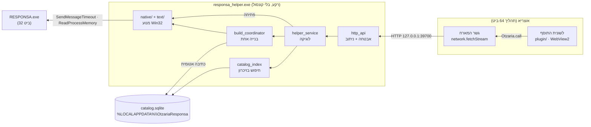
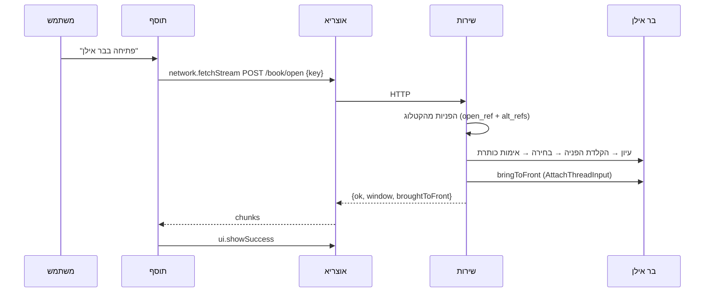

# ארכיטקטורה, תחזוקה ודיבוג

למפתחים ולמתחזקים. **למשתמשים:** [USER_GUIDE.md](USER_GUIDE.md). **החוזה בין הרכיבים:** [PROTOCOL.md](PROTOCOL.md).

---

## 1. התמונה הכללית



**למה ככה:**
- **תוסף לא יכול להריץ קוד מקומי.** אין API להפעלת תהליך, ו-`app.openUrl` מקבל רק http/https. לכן שליטה בבר אילן חייבת לשבת בתהליך נפרד.
- **המתחזק של אוצריא הכריע** (Otzaria/otzaria#1593) שקוד כזה רץ כשירות מותקן שהתוסף פונה אליו ב-localhost, כמו תוסף היברובוקס.

---

## 2. הרכיבים

### `helper/` — השירות המקומי (Dart טהור)

| תיקייה או קובץ | תפקיד |
|---|---|
| `bin/responsa_helper.dart` | כניסה: ארגומנטים, נעילת מופע דרך הפורט, `runZonedGuarded` |
| `lib/src/server/http_api.dart` | כללי אבטחה, ניתוב, JSON ו-NDJSON עם heartbeat |
| `lib/src/server/helper_service.dart` | כל נקודת קצה כמתודה; מיפוי כשלים להודעות למשתמש |
| `lib/src/server/build_coordinator.dart` | בנייה אחת, לא קשורה לחיבור; `start` ו-`attach` |
| `lib/src/server/catalog_store.dart` + `catalog_index.dart` | הקטלוג בזיכרון, נטען מחדש כשהקובץ משתנה |
| `lib/src/server/responsa_backend.dart` | ממשק מעל המנוע. `FakeBackend` בבדיקות |
| `lib/src/native/` | מנוע ה-Win32: גילוי התקנה, קריאת העץ, פתיחה, חיפוש טקסט, בנייה. הועבר מ-Otzaria#1572 |
| `lib/src/text/` | עברית: נרמול, שמות, מחברים, ביבליוגרפיה. בלי Win32 |
| `lib/src/catalog/` | מאגר הקטלוג, מיפוי קטגוריות לאוצריא, סמל |
| `lib/src/log.dart` | יומן לכל האיזולטים, לקובץ ול-stderr כשיש |

### `plugin/` — התוסף (JS רגיל, בלי build)

מחולק לשכבות עם גבולות ברורים. כל שכבה משתמשת רק בשכבות שמתחתיה:

| קובץ | מותר | אסור |
|---|---|---|
| `responsa-domain.js` | החלטות: איזה מסך, התקדמות, טקסטים | DOM, SDK, טיימרים |
| `responsa-service.js` | `network.fetchStream`, JSON, NDJSON, תרגום שגיאות | DOM |
| `responsa-theme.js` | ערכה ← משתני CSS | לוגיקה |
| `responsa-ui.js` | בניית DOM, רק `textContent` | SDK, החלטות |
| `responsa-app.js` | בקר (מצב, טיימרים, מחזור חיים) + View | בניית DOM ישירה |
| `responsa-main.js` | חיבור לאירועי אוצריא | כל השאר |

### `installer/` — מתקין Inno Setup

- **`OtzariaResponsa.iss`:** מתקין בעברית, למשתמש בלבד.
- **`build.ps1`:** בונה הכול. הקובץ שמור ב-**UTF-8 עם BOM**, כי PowerShell 5.1 קורא בלעדיו ANSI.

---

## 3. החלטות תכנון, ולמה

| החלטה | הסיבה | מה נשבר בלעדיה |
|---|---|---|
| **הפעלה בכניסה (HKCU\Run), לא שירות Windows** | שירות רץ ב-Session 0 ולא רואה את חלונות בר אילן בסשן של המשתמש | אין שליטה בבר אילן בכלל |
| **קובץ ההרצה מסומן GUI** (`tools/set_gui_subsystem.py`) | אחרת נפתח חלון קונסול שחור בכל כניסה | חלון שחור בכל הפעלה של Windows |
| **`logLine` בודק `GetStdHandle` לפני כתיבה ל-stderr** | בתוכנת GUI אין stderr, והכתיבה נכשלת *באיחור*, כשגיאה שלא נתפסה | השירות מת שנייה אחרי שעלה (נמדד) |
| **`runZonedGuarded` ב-`main`** | שירות רקע אסור שימות בשקט | קריסה בלי עקבות |
| **טווח פורטים קבוע, 39700–39709** | אפס הגדרות למשתמש. 39625 תפוס אצל כלי המחקר (`MD/tools/hidden_manager.py`) | — |
| **הנעילה היא הפורט עצמו** | פשוט יותר מ-mutex. `/health` מבחין בין "כבר רץ" (קוד 3), משתמש אחר ותוכנה אחרת (ממשיכים לפורט הבא) | — |
| **בדיקת session לכל בקשה** (`peer_session.dart`) | 127.0.0.1 משותף לכל משתמשי Windows שמחוברים למחשב | משתמש ב' היה פותח ספרים על המסך של משתמש א' |
| **בנייה, פתיחה וחיפוש אינם רצים יחד** | כולם מפעילים את אותו מופע, ופתיחה וחיפוש גם את אותם מודאלים | פתיחה בזמן בנייה משבשת את הסריקה; חיפוש בזמן פתיחה משאיר מודאל שחוסם את הפתיחה |
| **לחיצת "בצע חיפוש" ב-`PostMessage`, לא ב-`SendMessageTimeout`** | הכפתור מריץ את החיפוש ופותח מודאל, ורק אז חוזר | נמדד: `BM_CLICK` סינכרוני על כפתור שפותח מודאל לא חזר |
| **שאלה במודאל "מידע" נסגרת ב"ביטול"** | שאלה (כן/לא/ביטול) חוסמת את התוכנה כמו הודעה, ואין בה "אישור". "כן" מריץ פעולה חדשה | שאלה שנשארת פתוחה חוסמת כל פתיחה: כל הפניה מחזירה 0 תוצאות |
| **תוצאות החיפוש נשארות בבר אילן** | אין העתקת תוכן מבר אילן; המשתמש ממשיך בממשק שלו | — |
| **יומן ב-`FILE_APPEND_DATA`** | seek ו-write אינם אטומיים בין איזולטים | נמדד: 3,016 מתוך 6,000 שורות שרדו |
| **מתקין שהורץ כמנהל מפעיל דרך `explorer.exe`** | אחרת ההרשאה עוברת לשירות ומשם לבר אילן | בר אילן מוגבה, ששירות רגיל לא יכול לגשת אליו |
| **בלי token** | אוצריא (Dart HttpClient) לא שולחת `Origin`/`Sec-Fetch-*`, ודפדפן תמיד שולח. יחד עם בדיקת `Host` ו-`Content-Type` זה חוסם דפים | משתמש היה צריך לצמד תוסף ושירות |
| **בנייה לא קשורה לחיבור, ו-`mode: attach`** | `fetchStream` נחתך אחרי 120 שניות, ובנייה אורכת חמש עד שש דקות. חיבור מחדש **לא** מתחיל בנייה | בנייה נוספת בכל חזרה ללשונית |
| **קטלוג קיים שמיש בזמן בנייה מחדש** | הבנייה כותבת ל-`.building` ומחליפה רק אחרי אימות | החיפוש חסום 6 דקות |
| **הקטלוג ב-`%LOCALAPPDATA%`, לא בספריית אוצריא** | המתקין של אוצריא והעברת ספרייה מוחקים את מה שבתוכה | מזהי הספרים אובדים. ב-#1572 זה הצריך מנגנון גיבוי |
| **`bringToFront` דרך `AttachThreadInput`** | Windows מתיר החלפת חזית רק לתהליך שקיבל את הקלט האחרון, והשירות אינו כזה | בר אילן מהבהב בשורת המשימות במקום לעלות |
| **מכנה ההתקדמות בבנייה ראשונה מטבלת מהדורות** (`knownNodeCounts`) | חלוקה ל"חלק X מתוך 20" אינה אחידה | אחוז מטעה |
| **אוצריא נמצאת לפי `InstallLocation`, לפני מטפל `otzaria://`** | אצל מפתחים המטפל מצביע על בנייה מקומית | התוסף נמסר לבנייה הלא נכונה |

---

## 4. זרימות

### פתיחת ספר



**פתיחה אחת בכל רגע:**
- בשירות: פתיחה שנייה מקבלת `busy`.
- בתוסף: הכפתורים האחרים כבויים בזמן פתיחה.

### חיפוש טקסט (`POST /text/search`)

המשתמש בוחר טקסט באוצריא, ובר אילן מחפש אותו כאילו הוקלד בחלון החיפוש שלו. התוצאות נשארות בממשק של בר אילן.

1. **ניקוי** (`text/responsa_query.dart`): רק מילים עבריות, עד 10. תווי החיפוש המתקדם של בר אילן הם אופרטורים, ולכן נמחקים.
2. **הפעלה:** כמו בפתיחה, `ResponsaLauncher.ensureRunning` (לפי `autoStart`), על ההתקנה שממנה נבנה הקטלוג.
3. **ניקיון לפני** (`native/responsa_search_automation.dart`):
   - סיכום חיפוש קודם (`<N> תוצאות`) נסגר ב"אישור". הוא מודאל, ומשבית את החלון הראשי;
   - מודאל "מידע" נסגר ב"אישור", ושאלה (כן/לא/ביטול) ב"ביטול";
   - `releaseMdiWindows`, כמו בפתיחה: כל חיפוש מוצלח מוסיף חלון MDI, ובכ-22 בר אילן מפסיק בשקט ליצור חלונות.
4. **חלון החיפוש:** `WM_COMMAND 32857` לחלון הראשי יוצר ארבעה דיאלוגים: `חיפוש קל`, `חיפוש טבלאי`, `חיפוש מתקדם`, `חיפוש בניסוח חופשי`. רק המצב שהמשתמש בחר מוצג, והשאר מוסתרים.
   - **מתאים:** דיאלוג עם `Edit` יחיד (1233) וכפתור "בצע חיפוש". הטבלאי (כ-17 שדות) לא מתאים, וזה מכוון;
   - **עדיפות:** נראה קודם. מוסתר מתאים גם הוא, כי לחיצה עליו מריצה חיפוש (נמדד);
   - **אם אין אף אחד:** הפקודה נשלחת שוב כל 3 שניות, עד 12 שניות. שליחה חוזרת לא מציגה דיאלוג מוסתר.
5. **הרצה:** `WM_SETTEXT` לשדה (בלי פוקוס), ואז `PostMessage(BM_CLICK)`. **לא** `SendMessageTimeout`: הכפתור מריץ את החיפוש ופותח מודאל, וקריאה סינכרונית עליו לא חזרה (נמדד).
6. **המתנה לתשובה** (עד 45 שניות; חיפוש כבד אורך 10–15). הסיווג (`ResponsaSearchAutomation.classify`) הוא פונקציה טהורה ונבדק בלי Win32:

| על המסך | `outcome` |
|---|---|
| חלון MDI חדש `נמצאו N תוצאות …`, ואחריו מודאל `N תוצאות` עם "הרחבה" | `found` |
| מודאל "מידע" עם כן/לא: "לא נמצאה כל תוצאה! … לחפש בכל המאגרים?" | `asked` |
| מודאל "מידע" עם "אישור" בלבד, למשל "נמצאו מעל 32000 תוצאות" | `refused` |
| `מצב התקדמות`, או עוד כלום | ממתינים |

7. **אחרי:** חלון התוצאות נרשם כשל אוצריא, כדי שישוחרר בתקרה. החלון הראשי עולה לחזית, והמודאלים שלו איתו. **אף מודאל לא נסגר:** הם הממשק שבו המשתמש ממשיך.

**מלכודות:**
- **מזהה 1** משותף במודאל הסיכום לכפתור "אישור", ל-`AfxWnd110u` ול-`ScrollBar`. כפתור נבחר תמיד לפי מחלקה וטקסט.
- **לחיצה שנייה** רק כשברור שהראשונה לא התקבלה: אחרי 4 שניות, בלי התקדמות, כשהדיאלוג לא הוסתר והתוכנה עונה ל-`WM_NULL`. אחרת היא הייתה מריצה חיפוש כפול.
- **מודאל שהיה פתוח לפני הלחיצה** אינו תשובה עליה, ולכן לא נקרא.
- **מהדורה באנגלית או בצרפתית:** כותרות הדיאלוגים שם לא נמדדו. הרמזים (`Search`, `Recherche`, `Results`) הם ניחוש, והמזהים הם הראיה העיקרית.

### בנייה

1. **התחלה:** `POST /catalog/build {mode:start}` מחזיר זרם NDJSON עם `start`, אחריו `progress` שוב ושוב, `heartbeat` כל 10 שניות, ובסוף `done` או `error`.
2. **חסם 120 שניות:** הזרם נחתך, והתוסף מתחבר מחדש ב-`attach` וממשיך מאותו מקום.
3. **הלשונית מוקפאת:** אוצריא מקפיאה לשונית שעזבו (`plugin.suspended`). הבנייה ממשיכה בשירות, וב-`plugin.resumed` התוסף מבצע `refresh` ואז `attach`.

---

## 5. דיבוג

### היומן

- **מיקום:** `%LOCALAPPDATA%\OtzariaResponsa\helper.log`.
- **סיבוב:** ב-2MB, ל-`helper.log.1`.
- **תוכן:**
  - כל בקשה: שיטה, נתיב, סטטוס, זמן;
  - פתיחות: המפתח, הכותרת וההפניה שהצליחה;
  - כשלים עם ההפניות שנוסו;
  - בנייה: סיום עם ספירות;
  - שגיאות שלא נתפסו (`uncaught:`);
  - הודעות האבחון של המנוע, כמו "מופעים חונים".
- **נתיב אחר:** משתנה הסביבה `OTZARIA_RESPONSA_LOG` קובע לאן היומן נכתב.

### קריאה ידנית לשירות

עברית בשורת הפקודה נשברת בקידוד, ולכן **את הגוף שולחים מקובץ UTF-8**:

```powershell
$H = 'http://127.0.0.1:39700'
curl.exe -s "$H/health"
curl.exe -s "$H/status"
'{"q":"אבני נזר","limit":5}' | Out-File -Encoding utf8NoBOM q.json   # PowerShell 7
curl.exe -s -X POST -H "Content-Type: application/json" --data-binary "@q.json" "$H/catalog/search"
```

- **בקשה מדפדפן נדחית ב-403.** זה מכוון.
- **מה בטוח לקרוא:** `/health`, `/status` ו-`/catalog/search` בטוחים. `/book/open`, `/text/search` ו-`/catalog/build` מפעילים את בר אילן על המסך.

### הרצת השירות מהקוד

```powershell
cd helper
dart run bin/responsa_helper.dart --port=39800 --data-dir=C:\temp\rp
```

כך אפשר להריץ עותק פיתוח לצד השירות המותקן.

### תקלות נפוצות

| תסמין | סיבה | בדיקה |
|---|---|---|
| **השירות יוצא מיד עם קוד 4** | תוכנה אחרת על 39700 | `netstat -ano \| findstr :39700` |
| **`running:false` כשבר אילן פתוח** | המופע "חונה" (x=-32000) או שייך להתקנה אחרת | ביומן: "מופעים חונים מחוץ למסך" |
| **בנייה נכשלת ב-`elevated`** | בר אילן כמנהל מערכת, והשירות לא | פתיחת בר אילן בלי הרשאות מנהל |
| **פתיחות או חיפושים מתחילים להיכשל אחרי שימוש ארוך** | תקרת כ-22 חלונות MDI. כל חיפוש מוצלח מוסיף חלון | `windowLimit` ביומן |
| **קליקים בבדיקה אוטומטית "נוחתים" במקום הקודם** | `SetCursorPos` לא מזיז את המצביע בתוך WebView של Flutter | תנועה ב-`MOUSEEVENTF_MOVE\|ABSOLUTE` |

---

## 6. בדיקות

| רמה | פקודה | מה נבדק |
|---|---|---|
| **שירות** | `cd helper && dart test` | 323 בדיקות: המנוע, החיפוש בקטלוג, ניקוי שאילתה וסיווג תשובת החיפוש בבר אילן, HTTP מקצה לקצה מול `FakeBackend`, אבטחה, session, בנייה ו-attach, ויומן מקבילי |
| **תוסף** | `node --test plugin/test/*.test.js` | 75 בדיקות: domain, service (גילוי פורט, הודעות המארח, fetchStream מדומה), app (בקר מול View מדומה), ומראה של בדיקת העיצוב |
| **החנות** | הוולידטור הרשמי (`installer/build.ps1` או CI) | אותן בדיקות שהחנות מריצה, כולל עיצוב |
| **חזותי** | `node tools/preview/screenshots.mjs` | כל מסך, בהיר וכהה, ב-Edge headless |
| **חי** | `dart test --run-skipped test/live_*` | מול בר אילן אמיתי: בנייה, פתיחת מדגם, פתיחת הכול |

**מדדים שנמדדו חי על CD25 (28.9.2026):**
- 1,251,889 צמתים הניבו 8,402 ספרים;
- 78 תוצאות לחיפוש מהרש"א;
- פתיחה ב-2.9 שניות;
- הבאה לחזית הצליחה;
- התקנה, עדכון והסרה של המתקין;
- התוסף באוצריא 0.9.97.

---

## 7. שחרור גרסה

1. **גרסה:** מעלים יחד, **לאותו מספר**, את `plugin/manifest.json` (`version`) ואת `HelperService.serverVersion`. `build.ps1` נכשל אם הם שונים.
2. **שינוי בפרוטוקול:** אם הוא שובר תאימות, מעלים את `apiVersion` בשני הצדדים (`HelperService.apiVersion` ו-`API_VERSION` בתוסף). תוסף ישן מול שירות חדש מציג "צריך לעדכן".
3. **תג:** `git tag v0.1.1 && git push --tags`. ה-CI בונה ומפרסם GitHub Release עם המתקין וקובץ התוסף.
4. **פרסום בחנות אוצריא:** **עדיין לא מחובר ב-CI** (`publish: false`). כשיוחלט לפרסם: `Otzaria/otzaria-plugin-validator@v1` עם סודות `OTZARIA_*`, כמו במרקר. `app-version` בתהליך שווה ל-`minAppVersion`, וה-CI בודק זאת.

---

## 8. מגבלות ידועות

- **המתקין לא חתום.** SmartScreen מציג אזהרה בהורדה הראשונה. חתימת קוד תסיר אותה.
- **חתימת קוד:** לא לשכוח לחתום **אחרי** `set_gui_subsystem.py`, כי תיקון הכותרת שובר חתימה.
- **מתקין שקט (`/VERYSILENT`)** מעדכן את השירות אבל לא מוסר את התוסף לאוצריא. זה מכוון: בפריסה שקטה אין משתמש שיאשר את חלון ההתקנה.
- **מהדורות שנבדקו חי:** CD25 ו-CD29. ההתאמה לשאר המהדורות מבנית, ולא נבדקה מקצה לקצה.
- **מסך הספרייה של אוצריא:** הספרים לא מופיעים באיתור הספר ובעיון, רק בלשונית התוסף. לשם כך נדרש שינוי קטן ביישום עצמו (Otzaria/otzaria#1593).
