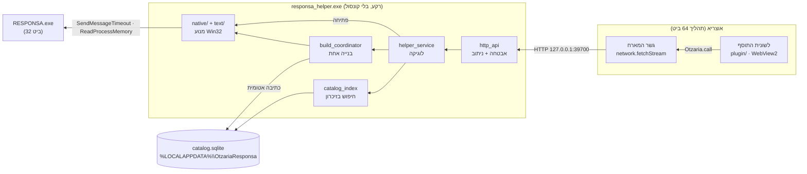
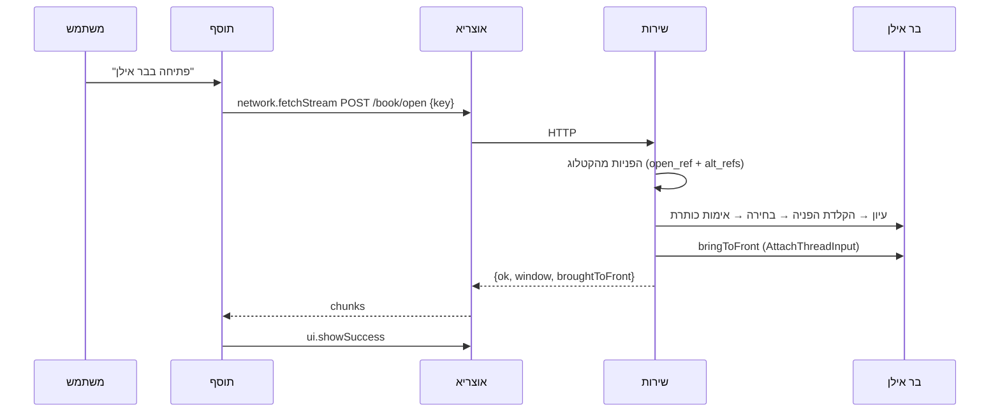

# ארכיטקטורה, תחזוקה ודיבוג

למפתחים ולמתחזקים. **למשתמשים:** [USER_GUIDE.md](USER_GUIDE.md). **החוזה בין הרכיבים:** [PROTOCOL.md](PROTOCOL.md).

---

## 1. התמונה הכללית



**למה ככה:**
- **תוסף לא יכול להריץ קוד מקומי.** אין API להפעלת תהליך, ו-`app.openUrl` מקבל רק http/https. לכן שליטה בבר אילן חייבת לשבת בתהליך נפרד.
- **המתחזק של אוצריא הכריע** (Otzaria/otzaria#1593) שקוד כזה רץ כשירות מותקן שהתוסף פונה אליו ב-localhost, כמו תוסף היברובוקס.

---

## 2. הרכיבים

### `helper/` — השירות המקומי (Dart טהור)

| תיקייה או קובץ | תפקיד |
|---|---|
| `bin/responsa_helper.dart` | כניסה: ארגומנטים, נעילת מופע דרך הפורט, `runZonedGuarded` |
| `lib/src/server/http_api.dart` | כללי אבטחה, ניתוב, JSON ו-NDJSON עם heartbeat |
| `lib/src/server/helper_service.dart` | כל נקודת קצה כמתודה; מיפוי כשלים להודעות למשתמש |
| `lib/src/server/build_coordinator.dart` | בנייה אחת, לא קשורה לחיבור; `start` ו-`attach` |
| `lib/src/server/catalog_store.dart` + `catalog_index.dart` | הקטלוג בזיכרון, נטען מחדש כשהקובץ משתנה |
| `lib/src/server/responsa_backend.dart` | ממשק מעל המנוע. `FakeBackend` בבדיקות |
| `lib/src/native/` | מנוע ה-Win32: גילוי התקנה, קריאת העץ, פתיחה, חיפוש טקסט, בנייה. הועבר מ-Otzaria#1572 |
| `lib/src/text/` | עברית: נרמול, שמות, מחברים, ביבליוגרפיה. בלי Win32 |
| `lib/src/catalog/` | מאגר הקטלוג, מיפוי קטגוריות לאוצריא, סמל |
| `lib/src/log.dart` | יומן לכל האיזולטים, לקובץ ול-stderr כשיש |

### `plugin/` — התוסף (JS רגיל, בלי build)

מחולק לשכבות עם גבולות ברורים. כל שכבה משתמשת רק בשכבות שמתחתיה (הסדר ב-`index.html`):

| קובץ | מותר | אסור |
|---|---|---|
| `responsa-i18n.js` + `i18n/en.js` | תרגום: עברית היא המקור ומפתח לעצמה; `t('…', {vars})`, כיוון, locale | DOM חוץ מ-`<html lang dir>` |
| `responsa-domain.js` | החלטות: איזה מסך, התקדמות, טקסטים, הודעות לפי קוד, פרטי ספר (`bookDetails`), רשימת ההכנה (`setupChecklist`), מיפוי לחיפוש הספרייה. `Links`: כל הכתובות החיצוניות | DOM, SDK, טיימרים |
| `responsa-log.js` | יומן בזיכרון (200 רשומות; debug/info/warn/error). info ומעלה מועתק ל-console. `scrub()` מקצר נתיבי `C:\Users\<שם>` | DOM, SDK |
| `responsa-runtime.js` | הגבול היחיד מול `Otzaria.call`: `call`/`callSoft`/`notify`/`on`, דלי קצב מקומי | DOM, החלטות |
| `responsa-settings.js` | הגדרות, כל אחת במפתח אחסון משלה (תנאי `when` במניפסט קורא אותו) | DOM |
| `responsa-service.js` | `network.fetchStream`, JSON, NDJSON, תרגום שגיאות המארח | DOM |
| `responsa-engine.js` | בלי מסך: פתיחה מהספרייה, חיפוש מסומן, פקודות, שליחת הרשימה לאוצריא | DOM |
| `responsa-theme.js` | ערכה ← משתני CSS | לוגיקה |
| `responsa-ui.js` | DOM של המסך הראשי, רק `textContent` | SDK, החלטות |
| `responsa-panels.js` | DOM של לוח ההגדרות, דיאלוג העזרה ומסך הפתיחה (`welcomeDialog`), וההבהרה על הרישיון | SDK, החלטות |
| `responsa-view.js` | מחבר מודל ל-DOM, עדכון במקום, פוקוס, `inert` | SDK |
| `responsa-app.js` | בקר: מצב, טיימרים, מחזור חיים, הגדרות, דיווח | בניית DOM ישירה |
| `responsa-main.js` | חיבור הלשונית לאירועי אוצריא | כל השאר |
| `background.html` + `responsa-background.js` | מנוע הרקע: log, runtime, service, settings, engine בלבד. השפה נקראת מחדש לפני כל אירוע | DOM, UI |

**היומן** (`ResponsaLog.shared`) אחד לכל דף: ללשונית יומן משלה ולמנוע הרקע יומן משלו. runtime, service, engine ו-app כותבים אליו. כל בקשה לשירות נרשמת ב-debug עם הזמן שלקחה.

### `installer/` — מתקין Inno Setup

- **`OtzariaResponsa.iss`:** מתקין בעברית, למשתמש בלבד.
- **`build.ps1`:** בונה הכול. הקובץ שמור ב-**UTF-8 עם BOM**, כי PowerShell 5.1 קורא בלעדיו ANSI.
- **התוסף מוצע רק כשצריך:** המתקין קורא את `version` מ-`manifest.json` בכל תיקייה תחת `%APPDATA%\otzaria\plugins\installed\com.otzaria-responsa\` (`.release-<hash>`, או `current` בגרסאות ישנות).
  - **אחת מהן בגרסת המתקין:** אין תיבת סימון, ומסך הסיום אומר שהתוסף מעודכן. אוצריא לא מסמנת איזו תיקייה פעילה, ולכן די באחת.
  - **גרסה אחרת:** "לעדכן את התוסף באוצריא לגרסה X (מומלץ)".
  - **אין מניפסט** (גם תיקייה ריקה שנשארת אחרי הסרה): "להתקין".
  - **מסך הסיום** מזכיר להדליק את "הוספת רכיבים לתוכנה" ואת "הפעלה ברקע לפי אירוע".
  - פירוט ב-[`docs/RELEASING.md`](RELEASING.md) §5.

### סמלים ואייקונים

| מה | מקור | איך נבנה |
|---|---|---|
| **הלשונית בסרגל הכלים** | אייקון של אוצריא, `book_open_medium_search_24_regular` (`toolTab.iconName`) | אוצריא מציירת אותו |
| **פריט התפריט** | `search_24_regular` של אוצריא | אוצריא מציירת אותו |
| **אייקונים בתוך הדף** | **אייקוני אוצריא מהגופן שבהתקנה של המשתמש**, כשיש לשם גליף; אחרת גליפים של Fluent System Icons (MIT) שבתוך התוסף | השירות מגיש את הגופן (`GET /otzaria/icons`), והדף טוען אותו ב-`ResponsaIcons.useHostFont`. ה-Fluent נבנה ב-`py -3 tools/icon/build_icons.py` ← `plugin/js/responsa-icons.js` |
| **הסמל של בר אילן ליד כל ספר** | הסמל שבתוך `RESPONSA.exe` של המשתמש | `GET /icon` של השירות |
| **סמל התוסף** (`plugin/icon/icon.png`) **והמתקין** (`installer/icon.ico`) | ציור מקורי של ספר פתוח וזכוכית מגדלת, `tools/icon/icon.html` | `node tools/icon/build_app_icon.mjs` (Edge או Chrome, ו-Pillow ל-ICO) |

**למה ציור מקורי, ולמה האייקונים של אוצריא נטענים מההתקנה:** ספריית `otzaria_icons` היא GPL-3.0. העתקה ממנה לתוסף הייתה מחייבת רישיון תואם לכל המאגר. כשהשירות קורא את הגופן מאוצריא שכבר מותקנת אצל המשתמש, שום דבר ממנה לא נארז ולא מופץ, והתוסף מקבל תמיד את האייקונים של הגרסה שמותקנת.

**כלל ההכרעה כמו באוצריא:** שם שקיים בשתי הספריות מצויר מאוצריא. `PREFERRED` ב-`build_icons.py` ממפה כמה שמות של Fluent לאייקון של אוצריא שמתאים יותר (למשל `search_info` ← `search_not_found`). הגליף מצויר כטקסט בתוך אותו SVG של 24×24, ולכן כללי הגודל של `.icon` חלים עליו בלי שינוי. אחרי שהגופן נטען, הדף מצויר מחדש (`View.redraw`).

---

## 3. החלטות תכנון, ולמה

| החלטה | הסיבה | מה נשבר בלעדיה |
|---|---|---|
| **הפעלה בכניסה (HKCU\Run), לא שירות Windows** | שירות רץ ב-Session 0 ולא רואה את חלונות בר אילן בסשן של המשתמש | אין שליטה בבר אילן בכלל |
| **קובץ ההרצה מסומן GUI** (`tools/set_gui_subsystem.py`) | אחרת נפתח חלון קונסול שחור בכל כניסה | חלון שחור בכל הפעלה של Windows |
| **`logLine` בודק `GetStdHandle` לפני כתיבה ל-stderr** | בתוכנת GUI אין stderr, והכתיבה נכשלת *באיחור*, כשגיאה שלא נתפסה | השירות מת שנייה אחרי שעלה (נמדד) |
| **`runZonedGuarded` ב-`main`** | שירות רקע אסור שימות בשקט | קריסה בלי עקבות |
| **טווח פורטים קבוע, 39700–39709** | אפס הגדרות למשתמש. 39625 תפוס אצל כלי המחקר (`MD/tools/hidden_manager.py`) | — |
| **הנעילה היא הפורט עצמו** | פשוט יותר מ-mutex. `/health` מבחין בין "כבר רץ" (קוד 3), משתמש אחר ותוכנה אחרת (ממשיכים לפורט הבא) | — |
| **בדיקת session לכל בקשה** (`peer_session.dart`) | 127.0.0.1 משותף לכל משתמשי Windows שמחוברים למחשב | משתמש ב' היה פותח ספרים על המסך של משתמש א' |
| **בנייה, פתיחה וחיפוש אינם רצים יחד** | כולם מפעילים את אותו מופע, ופתיחה וחיפוש גם את אותם מודאלים | פתיחה בזמן בנייה משבשת את הסריקה; חיפוש בזמן פתיחה משאיר מודאל שחוסם את הפתיחה |
| **לחיצת "בצע חיפוש" ב-`PostMessage`, לא ב-`SendMessageTimeout`** | הכפתור מריץ את החיפוש ופותח מודאל, ורק אז חוזר | נמדד: `BM_CLICK` סינכרוני על כפתור שפותח מודאל לא חזר |
| **שאלה במודאל "מידע" נסגרת ב"ביטול"** | שאלה (כן/לא/ביטול) חוסמת את התוכנה כמו הודעה, ואין בה "אישור". "כן" מריץ פעולה חדשה | שאלה שנשארת פתוחה חוסמת כל פתיחה: כל הפניה מחזירה 0 תוצאות |
| **תוצאות החיפוש נשארות בבר אילן** | אין העתקת תוכן מבר אילן; המשתמש ממשיך בממשק שלו | — |
| **יומן ב-`FILE_APPEND_DATA`** | seek ו-write אינם אטומיים בין איזולטים | נמדד: 3,016 מתוך 6,000 שורות שרדו |
| **מתקין שהורץ כמנהל מפעיל דרך `explorer.exe`** | אחרת ההרשאה עוברת לשירות ומשם לבר אילן | בר אילן מוגבה, ששירות רגיל לא יכול לגשת אליו |
| **בלי token** | אוצריא (Dart HttpClient) לא שולחת `Origin`/`Sec-Fetch-*`, ודפדפן תמיד שולח. יחד עם בדיקת `Host` ו-`Content-Type` זה חוסם דפים | משתמש היה צריך לצמד תוסף ושירות |
| **בנייה לא קשורה לחיבור, ו-`mode: attach`** | `fetchStream` נחתך אחרי 120 שניות, ובנייה אורכת חמש עד שש דקות. חיבור מחדש **לא** מתחיל בנייה | בנייה נוספת בכל חזרה ללשונית |
| **קטלוג קיים שמיש בזמן בנייה מחדש** | הבנייה כותבת ל-`.building` ומחליפה רק אחרי אימות | החיפוש חסום 6 דקות |
| **הקטלוג ב-`%LOCALAPPDATA%`, לא בספריית אוצריא** | המתקין של אוצריא והעברת ספרייה מוחקים את מה שבתוכה | מזהי הספרים אובדים. ב-#1572 זה הצריך מנגנון גיבוי |
| **`bringToFront` דרך `AttachThreadInput`** | Windows מתיר החלפת חזית רק לתהליך שקיבל את הקלט האחרון, והשירות אינו כזה | בר אילן מהבהב בשורת המשימות במקום לעלות |
| **מכנה ההתקדמות בבנייה ראשונה מטבלת מהדורות** (`knownNodeCounts`) | חלוקה ל"חלק X מתוך 20" אינה אחידה | אחוז מטעה |
| **אוצריא נמצאת לפי `InstallLocation`, לפני מטפל `otzaria://`** | אצל מפתחים המטפל מצביע על בנייה מקומית | התוסף נמסר לבנייה הלא נכונה |

---

## 4. זרימות

### הפעם הראשונה: מסך הפתיחה

1. **`App.boot`:** אם `responsa_welcome_seen` אינו `true`, נפתח הגיליון `welcome` מעל המסך שמתאים למצב המחשב. `refresh` רץ מתחתיו כרגיל.
2. **הסדר בתוכו** (`Panels.welcomeDialog`):
   1. **ההבהרה החשובה, ראשונה:** התוסף נועד למי שרכש כדין רישיון לבר אילן, "שארית ישראל לא יעשו עוולה" (צפניה ג, יג), ואינו מוצר רשמי של בר אילן. כך נקבע ב[פורום אוצריא](https://otzaria.org/forum/post/40010) (`Domain.Links.forum`). **כלל מוצר: לא מסירים ולא מזיזים.**
   2. מה התוסף עושה. שורת חיפוש הספרייה רק כשאוצריא מעניקה `library.books.provide`.
   3. **"מה צריך כדי להתחיל"** (`Domain.setupChecklist`): בר אילן מותקן, השירות פועל, "הוספת רכיבים לתוכנה" דלוקה, רשימת הספרים נקראה. לכל אחד `done`/`missing`/`unknown`, מתוך המודל החי, ולכן הרשימה מתעדכנת כשהמצב משתנה.
   4. "הבנתי, בואו נתחיל" (סוגר ומעביר פוקוס לחיפוש) ו"איך משתמשים" (עובר לעזרה).
3. **כל סגירה** (X, `Esc`, מעבר לעזרה) כותבת `responsa_welcome_seen`. שמירה שנכשלה רק תציג את המסך שוב בפעם הבאה.
4. **פתיחה מחדש:** "עזרה ותמיכה" (סימן השאלה) ← "אודות ודיווח" ← "מסך הפתיחה". אותה הבהרה מוצגת גם ב"אודות" עצמו.

### פתיחת ספר



**פתיחה אחת בכל רגע:**
- בשירות: פתיחה שנייה מקבלת `busy`.
- בתוסף: הכפתורים האחרים כבויים בזמן פתיחה.

### פרטי ספר

- **הכפתור:** לכל תוצאה כפתור אייקון "פרטי הספר". `App.toggleDetails(key)` שומר ב-`model.expandedKey` ספר אחד פתוח; חיפוש חדש סוגר אותו.
- **התוכן** (`Domain.bookDetails`): רק שדות שיש בהם ערך, מתוך תשובת `/catalog/search`. אין בקשה נוספת לשירות.
  - מחבר, מקום הדפסה, שנת הדפסה;
  - **מהדורה:** שורת המהדורה המלאה מהביבליוגרפיה של בר אילן. מוצגת רק כשיש בה יותר ממקום ושנה (למשל "ד"צ"), בהשוואה בלי רווחים ופסיקים;
  - מיקום בבר אילן, נושאים, הקטגוריה המקבילה באוצריא, ומזהה בבר אילן.
- **`edition` בשירות:** עמודה בקטלוג, שנקראת מהביבליוגרפיה שבקובץ העזרה (CHM) של בר אילן. היא נכתבה כבר בבניות קודמות, ולכן אין צורך לקרוא את הרשימה מחדש.

### חיפוש טקסט (`POST /text/search`)

המשתמש בוחר טקסט באוצריא, ובר אילן מחפש אותו כאילו הוקלד בחלון החיפוש שלו. התוצאות נשארות בממשק של בר אילן.

1. **ניקוי** (`text/responsa_query.dart`): רק מילים עבריות, עד 10. תווי החיפוש המתקדם של בר אילן הם אופרטורים, ולכן נמחקים.
   - **אורך:** התוסף שולח עד 2,000 תווים (`Domain.MAX_SELECTION_LENGTH`). `q` מעל 10,000 תווים **נחתך** בשירות ואינו נדחה, כדי שלקוח ישן שאינו מקצר בעצמו לא יקבל שגיאה.
2. **הפעלה:** כמו בפתיחה, `ResponsaLauncher.ensureRunning` (לפי `autoStart`), על ההתקנה שממנה נבנה הקטלוג.
3. **ניקיון לפני** (`native/responsa_search_automation.dart`):
   - סיכום חיפוש קודם (`<N> תוצאות`) נסגר ב"אישור". הוא מודאל, ומשבית את החלון הראשי;
   - מודאל "מידע" נסגר ב"אישור", ושאלה (כן/לא/ביטול) ב"ביטול";
   - `releaseMdiWindows`, כמו בפתיחה: כל חיפוש מוצלח מוסיף חלון MDI, ובכ-22 בר אילן מפסיק בשקט ליצור חלונות.
4. **חלון החיפוש:** `WM_COMMAND 32857` לחלון הראשי יוצר ארבעה דיאלוגים: `חיפוש קל`, `חיפוש טבלאי`, `חיפוש מתקדם`, `חיפוש בניסוח חופשי`. רק המצב שהמשתמש בחר מוצג, והשאר מוסתרים.
   - **מתאים:** דיאלוג עם `Edit` יחיד (1233) וכפתור "בצע חיפוש". הטבלאי (כ-17 שדות) לא מתאים, וזה מכוון;
   - **עדיפות:** נראה קודם. מוסתר מתאים גם הוא, כי לחיצה עליו מריצה חיפוש (נמדד);
   - **אם אין אף אחד:** הפקודה נשלחת שוב כל 3 שניות, עד 12 שניות. שליחה חוזרת לא מציגה דיאלוג מוסתר.
5. **הרצה:** `WM_SETTEXT` לשדה (בלי פוקוס), ואז `PostMessage(BM_CLICK)`. **לא** `SendMessageTimeout`: הכפתור מריץ את החיפוש ופותח מודאל, וקריאה סינכרונית עליו לא חזרה (נמדד).
6. **המתנה לתשובה** (עד 45 שניות; חיפוש כבד אורך 10–15). הסיווג (`ResponsaSearchAutomation.classify`) הוא פונקציה טהורה ונבדק בלי Win32:

| על המסך | `outcome` |
|---|---|
| חלון MDI חדש `נמצאו N תוצאות …`, ואחריו מודאל `N תוצאות` עם "הרחבה" | `found` |
| מודאל "מידע" עם כן/לא: "לא נמצאה כל תוצאה! … לחפש בכל המאגרים?" | `asked` |
| מודאל "מידע" עם "אישור" בלבד, למשל "נמצאו מעל 32000 תוצאות" | `refused` |
| `מצב התקדמות`, או עוד כלום | ממתינים |

7. **אחרי:** חלון התוצאות נרשם כשל אוצריא, כדי שישוחרר בתקרה. החלון הראשי עולה לחזית, והמודאלים שלו איתו. **אף מודאל לא נסגר:** הם הממשק שבו המשתמש ממשיך.

**מלכודות:**
- **מזהה 1** משותף במודאל הסיכום לכפתור "אישור", ל-`AfxWnd110u` ול-`ScrollBar`. כפתור נבחר תמיד לפי מחלקה וטקסט.
- **לחיצה שנייה** רק כשברור שהראשונה לא התקבלה: אחרי 4 שניות, בלי התקדמות, כשהדיאלוג לא הוסתר והתוכנה עונה ל-`WM_NULL`. אחרת היא הייתה מריצה חיפוש כפול.
- **מודאל שהיה פתוח לפני הלחיצה** אינו תשובה עליה, ולכן לא נקרא.
- **מהדורה באנגלית או בצרפתית:** כותרות הדיאלוגים שם לא נמדדו. הרמזים (`Search`, `Recherche`, `Results`) הם ניחוש, והמזהים הם הראיה העיקרית.

### חיפוש טקסט מסומן, מתוך ספר באוצריא

1. **התפריט:** `contributes.startup.contextMenuItems` מצהיר על `responsa-search`, עם `when` על `responsa_context_menu`. המתג בהגדרות כותב את המפתח, ואוצריא מסתירה את הפריט מיד, בלי מנוע.
2. **הקיצור:** `contributes.startup.shortcuts` עם `contextMenuItemId`: אותה פעולה כמו לחיצה על הפריט (דורש טקסט מסומן).
3. **הלחיצה:** אוצריא שולחת `contextMenu.itemClicked` (וגם `reader.context_menu_item_clicked`, שבכוונה אינו מטופל) ב-`preferBackground`:
   - **עם `app.run_on_startup`:** מנוע הרקע (`background.html`) קם ומטפל, והמשתמש נשאר בספר;
   - **בלי:** אוצריא פותחת את לשונית התוסף ומוסרת לה את האירוע. `Engine` זהה בשני המקומות.
4. **`Engine.searchSelection`** ← `POST /text/search` ← הודעה (`ui.showSuccess`/`ui.showError`) לפי `outcome`.
5. **תלות:** פריט התפריט, הקיצורים וספק הספרים הם תרומות עלייה, ולכן דורשים את ההרשאה `app.startup_contributions`. **אוצריא מציעה אותה כבויה בהתקנה**, והתוסף מזהה זאת ומסביר (הערה מעל החיפוש + הסבר בהגדרות).

### עיון בקטגוריות ותחום החיפוש

1. **הרמה הנוכחית** נטענת כשהמסך מוכן (גם כשיש חיפוש, כדי שתהיה מוכנה כשהתיבה תתרוקן): `POST /catalog/browse {path}` ← `model.browse.level`. רשימה שנקראה מחדש (`catalog.builtAt` או המהדורה השתנו) טוענת אותה שוב.
2. **מעבר** (`App.browseTo`): שורת נתיב (breadcrumbs), תתי-קטגוריות עם מספר ספרים, והספרים שבקטגוריה. הנתיב נשמר ב-`responsa_browse_path`, והלשונית נפתחת בו שוב.
3. **תחום החיפוש:** `model.browse.path` נשלח כ-`path` ב-`/catalog/search`. "חיפוש בכל הספרים" (`searchEverywhere`) חוזר לשורש ושומר את מה שהוקלד.
4. **קטגוריה שנעלמה** (404 `notFound`, למשל אחרי קריאה מחדש): חזרה לשורש.
5. **שירות ישן** (בלי היכולת `browse`): אין עיון, החיפוש בלי `path`, והערה ממליצה להוריד את הגרסה החדשה.

### ספרי בר אילן בחיפוש הספרייה של אוצריא (מאוצריא 0.9.98)

**שני מסלולים:** המניפסט ב-`main` מכוון לאוצריא 0.9.97, ואין בו ספק ספרים. הגרסה עם הספק (`library.books.provide` ו-`startup.libraryBooks`, `minAppVersion` 0.9.98) ממתינה ל-PR המארח באוצריא. הקוד זהה בשתיהן: בלי ההרשאה (`Domain.hostSupportsLibrary`) שורת מסך הפתיחה, נושא העזרה ושאלת פתרון הבעיות אינם מוצגים. המתג בהגדרות מוצג תמיד: בלי תמיכה הוא שומר את הבחירה (`responsa_library_books`), עם הערה שהיא תחול מאוצריא 0.9.98.

1. **המניפסט** (במסלול 0.9.98) מצהיר על ספק `responsa` ב-`contributes.startup.libraryBooks`, עם `when` על `responsa_library_books`, והרשאת `library.books.provide`. בלי ההרשאה התוסף אינו מנסה.
2. **השליחה** (`Engine.syncLibrary`): כשהרשימה מוכנה, `GET /catalog/export` ← `Domain.libraryBooksFromExport` ← `library.setProviderBooks` (קריאה אחת, כ-8,400 ספרים, כמיליון בייטים). הסימון `responsa_library_sync` (`builtAt`) מונע שליחה חוזרת; הרשימה נשלחת שוב רק אחרי קריאה מחדש, או בגרסת תוסף חדשה.
   - **בלי "הוספת רכיבים לתוכנה"** אוצריא אינה רושמת את הספק ודוחה את השליחה (`error.not_found`). לכן `syncLibrary` מדלג כשההרשאה כבויה.
   - **אחרי כשל:** ניסיון נוסף רק בעוד עשר דקות. שינוי בהרשאות (`Engine.setPermissions`) מבטל את ההמתנה, כי ייתכן שבדיוק הוא מה שחסר.
3. **אוצריא שומרת** את הרשימה במסד התוספים ומציגה אותה גם כשהתוסף אינו פעיל. המתג מסתיר אותה דרך `when`, בלי שליחה מחדש.
4. **בחירת ספר** במסך הספרייה ← `library.providerBook.openRequested {provider, id, title}` ← `Engine.openFromLibrary` ← `POST /book/open {key: id}`.

### בנייה

1. **התחלה:** `POST /catalog/build {mode:start}` מחזיר זרם NDJSON עם `start`, אחריו `progress` שוב ושוב, `heartbeat` כל 10 שניות, ובסוף `done` או `error`.
2. **חסם 120 שניות:** הזרם נחתך, והתוסף מתחבר מחדש ב-`attach` וממשיך מאותו מקום.
3. **הלשונית מוקפאת:** אוצריא מקפיאה לשונית שעזבו (`plugin.suspended`). הבנייה ממשיכה בשירות, וב-`plugin.resumed` התוסף מבצע `refresh` ואז `attach`.

### בלי אינטרנט

התוסף עצמו אינו צריך אינטרנט: כל התקשורת היא ל-`127.0.0.1`. מה שמשתנה:
- **הזיהוי:** `plugin.boot` ← `connectivity.isOnline` ← `model.online` (`true`/`false`, או `null` כשאוצריא עוד לא יודעת).
- **קישורים** (`App.openLink`): כש-`online === false`, במקום דפדפן שייפתח לדף שגיאה מוצגת הודעה עם הכתובת. ב"אודות" מופיעה הערה מעל הקישורים.
- **"צריך להתקין רכיב קטן":** בלי אינטרנט, המסך מסביר להוריד את המתקין במחשב אחר ולהעביר אותו.
- **דיווח על בעיה:** אוצריא מחזירה `queued` ושולחת כשיש חיבור.

### יומן, אבחון ודיווח

1. **רישום:** כל רכיב כותב ל-`ResponsaLog.shared`. info ומעלה מועתק ל-console, ואוצריא כותבת אותו ליומן שלה כ-`Plugin [com.otzaria-responsa]: [responsa] …`. זו הדרך לראות את מנוע הרקע, שאין לו מסך.
2. **"מצב המערכת"** (עזרה): פרטי המערכת (`Panels.statusFacts`) ו"פעולות אחרונות": 40 הרשומות האחרונות מ-info ומעלה, מהחדשה לישנה. הרשימה מתעדכנת כשהכרטיסייה פתוחה.
3. **"העתקת הפרטים"** (`App._diagnostics`): הפרטים, כולל מיקום ההתקנה, ועד 150 רשומות אחרונות (גם debug). נתיבי `C:\Users\<שם>` מקוצרים (`scrub`).
4. **"שליחת דיווח"** (`feedback.report`, `reportType: bug`): התיאור, הפרטים **בלי** מיקום ההתקנה, ואחריהם סוף היומן, בכמה שנכנס. הכול עד 5,000 תווים. אוצריא מציגה אישור משלה לפני השליחה.
5. **מסכי כשל** (שירות לא מגיב, קריאת הרשימה נכשלה) מציגים "קוד לתמיכה: <code>" (`model.errorCode`), כדי שהמשתמש יוכל לצטט אותו.

---

## 5. דיבוג

### יומן התוסף

- **בלשונית:** עזרה ← מצב המערכת ← "פעולות אחרונות". "העתקת הפרטים" מעתיקה גם את ה-debug (כל בקשה לשירות, עם זמן).
- **ביומן של אוצריא:** שורות `Plugin [com.otzaria-responsa]: [responsa] …`, מ-info ומעלה. כך רואים גם את מנוע הרקע.
- **בזיכרון בלבד:** היומן מתאפס כשהלשונית או מנוע הרקע נטענים מחדש.

### יומן השירות

- **מיקום:** `%LOCALAPPDATA%\OtzariaResponsa\helper.log`.
- **סיבוב:** ב-2MB, ל-`helper.log.1`.
- **תוכן:**
  - כל בקשה: שיטה, נתיב, סטטוס, זמן;
  - פתיחות: המפתח, הכותרת וההפניה שהצליחה;
  - כשלים עם ההפניות שנוסו;
  - בנייה: סיום עם ספירות;
  - שגיאות שלא נתפסו (`uncaught:`);
  - הודעות האבחון של המנוע, כמו "מופעים חונים".
- **נתיב אחר:** משתנה הסביבה `OTZARIA_RESPONSA_LOG` קובע לאן היומן נכתב.

### קריאה ידנית לשירות

עברית בשורת הפקודה נשברת בקידוד, ולכן **את הגוף שולחים מקובץ UTF-8**:

```powershell
$H = 'http://127.0.0.1:39700'
curl.exe -s "$H/health"
curl.exe -s "$H/status"
'{"q":"אבני נזר","limit":5}' | Out-File -Encoding utf8NoBOM q.json   # PowerShell 7
curl.exe -s -X POST -H "Content-Type: application/json" --data-binary "@q.json" "$H/catalog/search"
```

- **בקשה מדפדפן נדחית ב-403.** זה מכוון.
- **מה בטוח לקרוא:** `/health`, `/status` ו-`/catalog/search` בטוחים. `/book/open`, `/text/search` ו-`/catalog/build` מפעילים את בר אילן על המסך.

### הרצת השירות מהקוד

```powershell
cd helper
dart run bin/responsa_helper.dart --port=39800 --data-dir=C:\temp\rp
```

כך אפשר להריץ עותק פיתוח לצד השירות המותקן.

### תקלות נפוצות

| תסמין | סיבה | בדיקה |
|---|---|---|
| **השירות יוצא מיד עם קוד 4** | תוכנה אחרת על 39700 | `netstat -ano \| findstr :39700` |
| **`running:false` כשבר אילן פתוח** | המופע "חונה" (x=-32000) או שייך להתקנה אחרת | ביומן: "מופעים חונים מחוץ למסך" |
| **בנייה נכשלת ב-`elevated`** | בר אילן כמנהל מערכת, והשירות לא | פתיחת בר אילן בלי הרשאות מנהל |
| **פתיחות או חיפושים מתחילים להיכשל אחרי שימוש ארוך** | תקרת כ-22 חלונות MDI. כל חיפוש מוצלח מוסיף חלון | `windowLimit` ביומן |
| **קליקים בבדיקה אוטומטית "נוחתים" במקום הקודם** | `SetCursorPos` לא מזיז את המצביע בתוך WebView של Flutter | תנועה ב-`MOUSEEVENTF_MOVE\|ABSOLUTE` |

---

## 6. בדיקות

| רמה | פקודה | מה נבדק |
|---|---|---|
| **שירות** | `cd helper && dart test` | 327 בדיקות (ועוד 9 חיות שמדולגות): המנוע, החיפוש בקטלוג, ניקוי שאילתה וסיווג תשובת החיפוש בבר אילן, HTTP מקצה לקצה מול `FakeBackend`, אבטחה, session, בנייה ו-attach, ויומן מקבילי |
| **תוסף** | `node --test plugin/test/*.test.js` | 152 בדיקות: domain (כולל פרטי ספר ורשימת ההכנה), service, runtime (דלי הקצב, ניסיון חוזר רק ב-`rate_limited`), settings, log (סינון, תקרה, `scrub`), engine (פתיחה מהספרייה, חיפוש מסומן, שליחת הרשימה), app (בקר מול View מדומה: מסך הפתיחה, בלי אינטרנט, דיווח), מילון האנגלית (שלם, בלי מפתחות יתומים, משתנים זהים), חוזה בין הקוד ל-CSS ולאייקונים, המניפסט מול הקוד, ומראה של בדיקת העיצוב |
| **דפדפן** | `node tools/preview/smoke.mjs` | כל מסך, לוח וכרטיסיית עזרה, מסך הפתיחה, פרטי ספר ומצב בלי אינטרנט, בעברית, באנגלית ובכהה: נכשל על כל שגיאה בקונסול. שורות `[responsa] …` של היומן אינן שגיאה, חוץ מ-`event … failed` |
| **החנות** | הוולידטור הרשמי (`installer/build.ps1` או CI) | אותן בדיקות שהחנות מריצה, כולל עיצוב |
| **חזותי** | `node tools/preview/screenshots.mjs` | כל מסך, בהיר וכהה, ב-Edge headless. גם ברוחב טלפון (380px), דרך iframe ברוחב מדויק, כי חלון headless אינו צר מ-500px |
| **חי** | `dart test --run-skipped test/live_*` | מול בר אילן אמיתי: בנייה, פתיחת מדגם, פתיחת הכול |

**מדדים שנמדדו חי על CD25 (28.9.2026):**
- 1,251,889 צמתים הניבו 8,402 ספרים;
- 78 תוצאות לחיפוש מהרש"א;
- פתיחה ב-2.9 שניות;
- הבאה לחזית הצליחה;
- התקנה, עדכון והסרה של המתקין;
- התוסף באוצריא 0.9.97.

---

## 7. שחרור גרסה

1. **גרסה:** מעלים יחד, **לאותו מספר**, את `plugin/manifest.json` (`version`) ואת `HelperService.serverVersion`. `build.ps1` נכשל אם הם שונים.
2. **שינוי בפרוטוקול:** אם הוא שובר תאימות, מעלים את `apiVersion` בשני הצדדים (`HelperService.apiVersion` ו-`API_VERSION` בתוסף). תוסף ישן מול שירות חדש מציג "צריך לעדכן".
3. **תג:** `git tag v0.2.0 && git push origin v0.2.0`. ה-CI בונה ומפרסם GitHub Release עם המתקין וקובץ התוסף.
4. **פרסום בחנות אוצריא:** ה-job `store` מפרסם את קובץ התוסף שב-Release (`publish: auto`), עם הסודות `OTZARIA_USER` ו-`OTZARIA_PASSWORD`. `app-version` בכל מופע שווה ל-`minAppVersion`, וה-CI בודק זאת.

פירוט מלא, כולל ההגדרה החד-פעמית של החנות: [RELEASING.md](RELEASING.md).

---

## 8. מגבלות ידועות

- **המתקין לא חתום.** SmartScreen מציג אזהרה בהורדה הראשונה. חתימת קוד תסיר אותה.
- **חתימת קוד:** לא לשכוח לחתום **אחרי** `set_gui_subsystem.py`, כי תיקון הכותרת שובר חתימה.
- **מתקין שקט (`/VERYSILENT`)** מעדכן את השירות אבל לא מוסר את התוסף לאוצריא. זה מכוון: בפריסה שקטה אין משתמש שיאשר את חלון ההתקנה.
- **מהדורות שנבדקו חי:** CD25 ו-CD29. ההתאמה לשאר המהדורות מבנית, ולא נבדקה מקצה לקצה.
- **מסך הספרייה של אוצריא:** דורש את ה-API הגנרי `contributes.startup.libraryBooks`, שנוסף לאוצריא ב-PR לגרסה 0.9.98 (Otzaria/otzaria#1593). עד שהוא ייכנס, המניפסט ב-`main` אינו מצהיר עליו, והממשק אינו מציג שום דבר שקשור לספרייה. הרשימה מופיעה בתוצאות איתור הספר, לא בעץ התיקיות.
- **כותרת הפריט בתפריט הלחיצה הימנית** מגיעה מהמניפסט בעברית. באנגלית התוסף מעדכן אותה (`reader.updateContextMenuItem`): הלשונית כשהיא נפתחת, ומנוע הרקע לפני כל אירוע שהוא מטפל בו. עד אחד מאלה, הכותרת בעברית.
- **יומן התוסף בזיכרון בלבד.** הוא מתאפס כשהלשונית נטענת מחדש, ויומן מנוע הרקע אינו מוצג בלשונית. מה שנשמר הוא השורות שאוצריא כותבת ליומן שלה.
