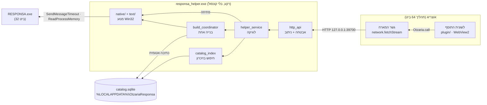
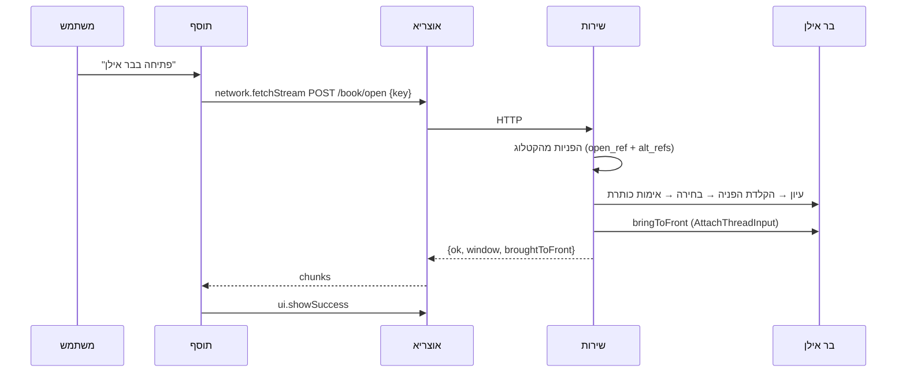
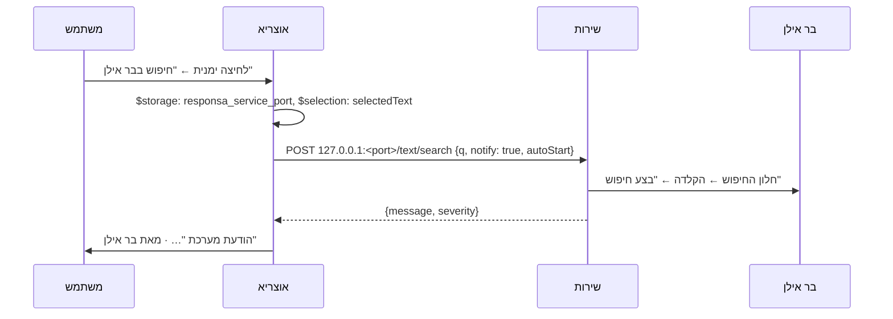

# ארכיטקטורה, תחזוקה ודיבוג

למפתחים ולמתחזקים. **למשתמשים:** [USER_GUIDE.md](USER_GUIDE.md). **החוזה בין הרכיבים:** [PROTOCOL.md](PROTOCOL.md).

---

## 1. התמונה הכללית



**למה ככה:**
- **תוסף לא יכול להריץ קוד מקומי.** אין API להפעלת תהליך, ו-`app.openUrl` מקבל רק http/https. לכן שליטה בבר אילן חייבת לשבת בתהליך נפרד.
- **המתחזק של אוצריא הכריע** (Otzaria/otzaria#1593) שקוד כזה רץ כשירות מותקן שהתוסף פונה אליו ב-localhost, כמו תוסף היברובוקס.

---

## 2. הרכיבים

### `helper/` — השירות המקומי (Dart טהור)

| תיקייה או קובץ | תפקיד |
|---|---|
| `bin/responsa_helper.dart` | כניסה: ארגומנטים, נעילת מופע דרך הפורט, `runZonedGuarded` |
| `lib/src/server/http_api.dart` | כללי אבטחה, ניתוב, JSON ו-NDJSON עם heartbeat |
| `lib/src/server/helper_service.dart` | כל נקודת קצה כמתודה; מיפוי כשלים להודעות למשתמש |
| `lib/src/server/build_coordinator.dart` | בנייה אחת, לא קשורה לחיבור; `start` ו-`attach` |
| `lib/src/server/catalog_store.dart` + `catalog_index.dart` | הקטלוג בזיכרון, נטען מחדש כשהקובץ משתנה |
| `lib/src/server/responsa_backend.dart` | ממשק מעל המנוע. `FakeBackend` בבדיקות |
| `lib/src/native/` | מנוע ה-Win32: גילוי התקנה, קריאת העץ, פתיחה, חיפוש טקסט, בנייה. הועבר מ-Otzaria#1572 |
| `lib/src/text/` | עברית: נרמול, שמות, מחברים, ביבליוגרפיה. בלי Win32 |
| `lib/src/catalog/` | מאגר הקטלוג, מיפוי קטגוריות לאוצריא, סמל |
| `lib/src/log.dart` | יומן לכל האיזולטים, לקובץ ול-stderr כשיש |

### `plugin/` — התוסף (JS רגיל, בלי build)

מחולק לשכבות עם גבולות ברורים. כל שכבה משתמשת רק בשכבות שמתחתיה (הסדר ב-`index.html`):

| קובץ | מותר | אסור |
|---|---|---|
| `responsa-i18n.js` + `i18n/en.js` | תרגום: עברית היא המקור ומפתח לעצמה; `t('…', {vars})`, כיוון, locale | DOM חוץ מ-`<html lang dir>` |
| `responsa-domain.js` | החלטות: איזה מסך, התקדמות, טקסטים, הודעות לפי קוד, פרטי ספר (`bookDetails`), רשימת ההכנה (`setupChecklist`), מיפוי לחיפוש הספרייה. `Links`: כל הכתובות החיצוניות | DOM, SDK, טיימרים |
| `responsa-advanced.js` | החיפוש בטקסט: מודל בשלושה אופנים (רגיל, בונה, תחביר), בניית השאילתה בתחביר של בר אילן (`buildQuery`), הסבר במילים (`describe`), בדיקה, גוף הבקשה, דוגמאות ומקרא, וחיפוש מדיאלוג החיפוש של אוצריא (`fromOtzariaSearch`) | DOM, SDK, טיימרים |
| `responsa-locate.js` | איתור מקום: נרמול, בדיקה, "אחרונים", ומקום מספר שפתוח באוצריא (`fromReader`, `rankChoices`, `displayOrder`) | DOM, SDK, טיימרים |
| `responsa-log.js` | יומן בזיכרון (200 רשומות; debug/info/warn/error). info ומעלה מועתק ל-console. `scrub()` מקצר נתיבי `C:\Users\<שם>` | DOM, SDK |
| `responsa-runtime.js` | הגבול היחיד מול `Otzaria.call`: `call`/`callSoft`/`notify`/`on`, דלי קצב מקומי | DOM, החלטות |
| `responsa-settings.js` | הגדרות, כל אחת במפתח אחסון משלה (תנאי `when` במניפסט קורא אותו), הלשונית האחרונה, "אחרונים", ומפתח הפורט | DOM |
| `responsa-service.js` | `network.fetchStream`, JSON, NDJSON, תרגום שגיאות המארח | DOM |
| `responsa-engine.js` | מול אוצריא ולא מול המסך: שליחת הרשימה לחיפוש הספרייה, שמירת הפורט (`savePort`), כותרות פריטי התפריט, הבאת הלשונית לחזית (`showSelf`) | DOM |
| `responsa-theme.js` | ערכה ← משתני CSS, ומעליה הגופן וגודל התצוגה מההגדרות (`applyAppearance`, `--ui-scale`) | לוגיקה |
| `responsa-ui.js` | DOM של לשונית "ספרים" ומסכי ההכנה, רק `textContent` | SDK, החלטות |
| `responsa-panels.js` | DOM של הלשוניות "הגדרות" ו"עזרה", מסך הפתיחה (`welcomeDialog`), וההבהרה על הרישיון | SDK, החלטות |
| `responsa-advanced-ui.js` | DOM של לשונית "חיפוש בטקסט" (`textSearchPage`) | SDK, החלטות |
| `responsa-locate-ui.js` | DOM של לשונית "איתור מקום" (`locatePage`) | SDK, החלטות |
| `responsa-view.js` | שורת הלשוניות, הלשונית הנוכחית, עדכון במקום, פוקוס, מסך הפתיחה (`inert`) | SDK |
| `responsa-app.js` | בקר: מצב, לשוניות, טיימרים, מחזור חיים, הגדרות, דיווח, ובקשות מאוצריא (קיצורים, "איתור המקום", דיאלוג החיפוש) | בניית DOM ישירה |
| `responsa-main.js` | חיבור הלשונית לאירועי אוצריא | כל השאר |

**אין מנוע רקע** (מ-0.5.0). "חיפוש בבר אילן" בלחיצה ימנית ופתיחה מחיפוש הספרייה הן פעולות `localService.post` במניפסט: אוצריא פונה בהן לשירות בעצמה, גם כשהלשונית סגורה (§4). "איתור המקום בבר אילן", "חיפוש בבר אילן" בדיאלוג החיפוש והקיצורים ללשוניות פותחים את הלשונית, ואוצריא מוסרת אליה את הבקשה (`contextMenu.itemClicked`, `search.requested`, `app.command`) גם כשהיא נטענת רק עכשיו. `App.ready` מעכב אותן עד שההגדרות ומצב השירות נקראו.

**היומן** (`ResponsaLog.shared`) אחד לדף. runtime, service, engine ו-app כותבים אליו. כל בקשה לשירות נרשמת ב-debug עם הזמן שלקחה.

### `installer/` — מתקין Inno Setup

- **`OtzariaResponsa.iss`:** מתקין בעברית, למשתמש בלבד.
- **`build.ps1`:** בונה הכול. הקובץ שמור ב-**UTF-8 עם BOM**, כי PowerShell 5.1 קורא בלעדיו ANSI.
- **התוסף מוצע רק כשצריך:** המתקין קורא את `version` מ-`manifest.json` בכל תיקייה תחת `%APPDATA%\otzaria\plugins\installed\com.otzaria-responsa\` (`.release-<hash>`, או `current` בגרסאות ישנות).
  - **אחת מהן בגרסת המתקין:** אין תיבת סימון, ומסך הסיום אומר שהתוסף מעודכן. אוצריא לא מסמנת איזו תיקייה פעילה, ולכן די באחת.
  - **גרסה אחרת:** "לעדכן את התוסף באוצריא לגרסה X (מומלץ)".
  - **אין מניפסט** (גם תיקייה ריקה שנשארת אחרי הסרה): "להתקין".
  - **מסך הסיום** מזכיר להדליק את "הוספת רכיבים לתוכנה".
  - פירוט ב-[`docs/RELEASING.md`](RELEASING.md) §5.

### סמלים ואייקונים

| מה | מקור | איך נבנה |
|---|---|---|
| **הלשונית בסרגל הכלים** | אייקון של אוצריא, `book_open_medium_search_24_regular` (`toolTab.iconName`) | אוצריא מציירת אותו |
| **פריט התפריט** | `search_24_regular` של אוצריא | אוצריא מציירת אותו |
| **אייקונים בתוך הדף** | **אייקוני אוצריא מהגופן שבהתקנה של המשתמש**, כשיש לשם גליף; אחרת גליפים של Fluent System Icons (MIT) שבתוך התוסף | השירות מגיש את הגופן (`GET /otzaria/icons`), והדף טוען אותו ב-`ResponsaIcons.useHostFont`. ה-Fluent נבנה ב-`py -3 tools/icon/build_icons.py` ← `plugin/js/responsa-icons.js` |
| **הסמל של בר אילן ליד כל ספר** | הסמל שבתוך `RESPONSA.exe` של המשתמש | `GET /icon` של השירות |
| **סמל התוסף** (`plugin/icon/icon.png`) **והמתקין** (`installer/icon.ico`) | ציור מקורי של ספר פתוח וזכוכית מגדלת, `tools/icon/icon.html` | `node tools/icon/build_app_icon.mjs` (Edge או Chrome, ו-Pillow ל-ICO) |

**למה ציור מקורי, ולמה האייקונים של אוצריא נטענים מההתקנה:** ספריית `otzaria_icons` היא GPL-3.0, כמו המאגר הזה (`LICENSE`), ולכן העתקה הייתה מותרת. ובכל זאת כשהשירות קורא את הגופן מאוצריא שכבר מותקנת אצל המשתמש, שום דבר ממנה לא נארז ולא מופץ, והתוסף מקבל תמיד את האייקונים של הגרסה שמותקנת.

**כלל ההכרעה כמו באוצריא:** שם שקיים בשתי הספריות מצויר מאוצריא. `PREFERRED` ב-`build_icons.py` ממפה כמה שמות של Fluent לאייקון של אוצריא שמתאים יותר (למשל `search_info` ← `search_not_found`). הגליף מצויר כטקסט בתוך אותו SVG של 24×24, ולכן כללי הגודל של `.icon` חלים עליו בלי שינוי. אחרי שהגופן נטען, הדף מצויר מחדש (`View.redraw`).

---

## 3. החלטות תכנון, ולמה

| החלטה | הסיבה | מה נשבר בלעדיה |
|---|---|---|
| **הפעלה בכניסה (HKCU\Run), לא שירות Windows** | שירות רץ ב-Session 0 ולא רואה את חלונות בר אילן בסשן של המשתמש | אין שליטה בבר אילן בכלל |
| **קובץ ההרצה מסומן GUI** (`tools/set_gui_subsystem.py`) | אחרת נפתח חלון קונסול שחור בכל כניסה | חלון שחור בכל הפעלה של Windows |
| **`logLine` בודק `GetStdHandle` לפני כתיבה ל-stderr** | בתוכנת GUI אין stderr, והכתיבה נכשלת *באיחור*, כשגיאה שלא נתפסה | השירות מת שנייה אחרי שעלה (נמדד) |
| **`runZonedGuarded` ב-`main`** | שירות רקע אסור שימות בשקט | קריסה בלי עקבות |
| **טווח פורטים קבוע, 39700–39709** | אפס הגדרות למשתמש. 39625 תפוס אצל כלי המחקר (`MD/tools/hidden_manager.py`) | — |
| **הנעילה היא הפורט עצמו** | פשוט יותר מ-mutex. `/health` מבחין בין "כבר רץ" (קוד 3), משתמש אחר ותוכנה אחרת (ממשיכים לפורט הבא) | — |
| **בדיקת session לכל בקשה** (`peer_session.dart`) | 127.0.0.1 משותף לכל משתמשי Windows שמחוברים למחשב | משתמש ב' היה פותח ספרים על המסך של משתמש א' |
| **בנייה, פתיחה וחיפוש אינם רצים יחד** | כולם מפעילים את אותו מופע, ופתיחה וחיפוש גם את אותם מודאלים | פתיחה בזמן בנייה משבשת את הסריקה; חיפוש בזמן פתיחה משאיר מודאל שחוסם את הפתיחה |
| **לחיצת "בצע חיפוש" ב-`PostMessage`, לא ב-`SendMessageTimeout`** | הכפתור מריץ את החיפוש ופותח מודאל, ורק אז חוזר | נמדד: `BM_CLICK` סינכרוני על כפתור שפותח מודאל לא חזר |
| **שאלה במודאל "מידע" נסגרת ב"ביטול"** | שאלה (כן/לא/ביטול) חוסמת את התוכנה כמו הודעה, ואין בה "אישור". "כן" מריץ פעולה חדשה | שאלה שנשארת פתוחה חוסמת כל פתיחה: כל הפניה מחזירה 0 תוצאות |
| **תוצאות החיפוש נשארות בבר אילן** | אין העתקת תוכן מבר אילן; המשתמש ממשיך בממשק שלו | — |
| **יומן ב-`FILE_APPEND_DATA`** | seek ו-write אינם אטומיים בין איזולטים | נמדד: 3,016 מתוך 6,000 שורות שרדו |
| **מתקין שהורץ כמנהל מפעיל דרך `explorer.exe`** | אחרת ההרשאה עוברת לשירות ומשם לבר אילן | בר אילן מוגבה, ששירות רגיל לא יכול לגשת אליו |
| **בלי token** | אוצריא (Dart HttpClient) לא שולחת `Origin`/`Sec-Fetch-*`, ודפדפן תמיד שולח. יחד עם בדיקת `Host` ו-`Content-Type` זה חוסם דפים | משתמש היה צריך לצמד תוסף ושירות |
| **בנייה לא קשורה לחיבור, ו-`mode: attach`** | `fetchStream` נחתך אחרי 120 שניות, ובנייה אורכת כמה דקות. חיבור מחדש **לא** מתחיל בנייה | בנייה נוספת בכל חזרה ללשונית |
| **קטלוג קיים שמיש בזמן בנייה מחדש** | הבנייה כותבת ל-`.building` ומחליפה רק אחרי אימות | החיפוש חסום כל זמן הבנייה |
| **הקטלוג ב-`%LOCALAPPDATA%`, לא בספריית אוצריא** | המתקין של אוצריא והעברת ספרייה מוחקים את מה שבתוכה | מזהי הספרים אובדים. ב-#1572 זה הצריך מנגנון גיבוי |
| **`bringToFront` דרך `AttachThreadInput`** | Windows מתיר החלפת חזית רק לתהליך שקיבל את הקלט האחרון, והשירות אינו כזה | בר אילן מהבהב בשורת המשימות במקום לעלות |
| **מכנה ההתקדמות בבנייה ראשונה מטבלת מהדורות** (`knownNodeCounts`) | חלוקה ל"חלק X מתוך 20" אינה אחידה | אחוז מטעה |
| **אוצריא נמצאת לפי `InstallLocation`, לפני מטפל `otzaria://`** | אצל מפתחים המטפל מצביע על בנייה מקומית | התוסף נמסר לבנייה הלא נכונה |

---

## 4. זרימות

### לשוניות

- **חמש לשוניות** (`View.TABS`): ספרים, חיפוש בטקסט, איתור מקום, הגדרות, עזרה. `model.tab` נשמר ב-`responsa_tab`, והתוסף נפתח בלשונית האחרונה. `plugin.page_opened` עם `view` פותח לשונית.
- **הניווט:** בחלון רחב — שורת לשוניות מתחת לפס העליון, על רקע הלשונית ולא בתוך הפס. צר (`@container shell`, 40em) — סרגל תחתון עם שמות קצרים (`short`). הרוחב נמדד ב-em של הממשק, ולכן "גודל תצוגה" גדול עובר לפריסה הצרה כשהתוכן כבר לא נכנס.
- **גופן וגודל תצוגה** (`responsa_font`, `responsa_scale`): `applyAppearance` קובע `--font-ui` ו-`--ui-scale`. כל הגדלים בדף ב-em מ-`--font-size-base` (חוץ מהפס העליון, שנשאר ב-px כמו הסרגל של אוצריא), ולכן מכפיל אחד מגדיל הכול. הגופן שנבחר גובר על `uiFontFamily` של אוצריא גם אחרי `theme.changed`; "כמו באוצריא" בתפריט הגופן מוצג ב-`--font-host`. התפריט הוא `popover` (שכבה עליונה, כי `.settings-card` חותך גלישה) שנצמד לשדה ב-CSS anchor positioning. המחוון מחיל את הגודל ב-`change` ולא ב-`input`, כי הדף כולו גדל מתחת לעכבר; `SCALE` (0.9–1.5, קפיצה 0.05) ו-`normalize` מעגל ערך שמור לקפיצה.
- **הלשוניות מצוירות ב-`boot`, לפני שהשירות ענה.** בלי שירות (עשרה פורטים) העזרה וההגדרות היו ממתינות.
- **מסכי ההכנה** (אין שירות, אין הרשאה, אין בר אילן) מוצגים ב"ספרים", וגם ב"חיפוש בטקסט" וב"איתור מקום". בלי רשימת ספרים או בזמן קריאה, חיפוש בטקסט ואיתור מקום עובדים, כי אינם נשענים עליה; רק בחירת קטגוריות מוסתרת.
- **רענון לשונית שאינה "ספרים"** (`View.refreshPage`) בונה אותה מחדש רק כשהתוכן השתנה, ושומר פוקוס וגלילה. הקלדה בחיפוש בטקסט מעדכנת רק את "מה יחופש" ואת התצוגה המקדימה (`View.updateAdvanced`).
- **מסך הפתיחה** הוא הדיאלוג היחיד. לחיצה מחוץ לו אינה סוגרת אותו (ההבהרה חובה); `Esc` ו"הבנתי" כן.

### הפעם הראשונה: מסך הפתיחה

1. **`App.boot`:** אם `responsa_welcome_seen` אינו `true`, נפתח הגיליון `welcome` מעל המסך שמתאים למצב המחשב. `refresh` רץ מתחתיו כרגיל.
2. **הסדר בתוכו** (`Panels.welcomeDialog`):
   1. **ההבהרה החשובה, ראשונה:** התוסף נועד למי שרכש כדין רישיון לבר אילן, "שארית ישראל לא יעשו עוולה" (צפניה ג, יג), ואינו מוצר רשמי של בר אילן. כך נקבע ב[פורום אוצריא](https://otzaria.org/forum/post/40010) (`Domain.Links.forum`). **כלל מוצר: לא מסירים ולא מזיזים.**
   2. מה התוסף עושה. שורת חיפוש הספרייה רק כשאוצריא מעניקה `library.books.provide`.
   3. **"מה צריך כדי להתחיל"** (`Domain.setupChecklist`): בר אילן מותקן, השירות פועל, "הוספת רכיבים לתוכנה" דלוקה, רשימת הספרים נקראה. לכל אחד `done`/`missing`/`unknown`, מתוך המודל החי, ולכן הרשימה מתעדכנת כשהמצב משתנה.
   4. "הבנתי, בואו נתחיל" (סוגר ומעביר פוקוס לחיפוש) ו"איך משתמשים" (עובר לעזרה).
3. **כל סגירה** (X, `Esc`, מעבר לעזרה) כותבת `responsa_welcome_seen`. שמירה שנכשלה רק תציג את המסך שוב בפעם הבאה.
4. **פתיחה מחדש:** הלשונית "עזרה" ← "אודות ודיווח" ← "מסך הפתיחה". אותה הבהרה מוצגת גם ב"אודות" עצמו.

### פתיחת ספר



**פתיחה אחת בכל רגע:**
- בשירות: פתיחה שנייה מקבלת `busy`.
- בתוסף: הכפתורים האחרים כבויים בזמן פתיחה.

### פרטי ספר

- **הכפתור:** לכל תוצאה כפתור אייקון "פרטי הספר". `App.toggleDetails(key)` שומר ב-`model.expandedKey` ספר אחד פתוח; חיפוש חדש סוגר אותו.
- **התוכן** (`Domain.bookDetails`): רק שדות שיש בהם ערך, מתוך תשובת `/catalog/search`. אין בקשה נוספת לשירות.
  - מחבר, מקום הדפסה, שנת הדפסה;
  - **מהדורה:** שורת המהדורה המלאה מהביבליוגרפיה של בר אילן. מוצגת רק כשיש בה יותר ממקום ושנה (למשל "ד"צ"), בהשוואה בלי רווחים ופסיקים;
  - מיקום בבר אילן, נושאים, הקטגוריה המקבילה באוצריא, ומזהה בבר אילן.
- **`edition` בשירות:** עמודה בקטלוג, שנקראת מהביבליוגרפיה שבקובץ העזרה (CHM) של בר אילן. היא נכתבה כבר בבניות קודמות, ולכן אין צורך לקרוא את הרשימה מחדש.

### חיפוש טקסט (`POST /text/search`)

המשתמש בוחר טקסט באוצריא, ובר אילן מחפש אותו כאילו הוקלד בחלון החיפוש שלו. התוצאות נשארות בממשק של בר אילן.

1. **ניקוי** (`text/responsa_query.dart`): רק מילים עבריות, עד 10. תווי החיפוש המתקדם של בר אילן הם אופרטורים, ולכן נמחקים.
   - **אורך:** התוסף שולח עד 2,000 תווים (`Domain.MAX_SELECTION_LENGTH`). `q` מעל 10,000 תווים **נחתך** בשירות ואינו נדחה, כדי שלקוח ישן שאינו מקצר בעצמו לא יקבל שגיאה.
2. **הפעלה:** כמו בפתיחה, `ResponsaLauncher.ensureRunning` (לפי `autoStart`), על ההתקנה שממנה נבנה הקטלוג.
3. **ניקיון לפני** (`native/responsa_search_automation.dart`):
   - סיכום חיפוש קודם (`<N> תוצאות`) נסגר ב"אישור". הוא מודאל, ומשבית את החלון הראשי;
   - מודאל "מידע" נסגר ב"אישור", ושאלה (כן/לא/ביטול) ב"ביטול";
   - `releaseMdiWindows`, כמו בפתיחה: כל חיפוש מוצלח מוסיף חלון MDI, ובכ-22 בר אילן מפסיק בשקט ליצור חלונות.
4. **חלון החיפוש:** `WM_COMMAND 32857` לחלון הראשי יוצר ארבעה דיאלוגים: `חיפוש קל`, `חיפוש טבלאי`, `חיפוש מתקדם`, `חיפוש בניסוח חופשי`. רק המצב שהמשתמש בחר מוצג, והשאר מוסתרים.
   - **מתאים:** דיאלוג עם `Edit` יחיד (1233) וכפתור "בצע חיפוש". הטבלאי (כ-17 שדות) לא מתאים, וזה מכוון;
   - **עדיפות:** נראה קודם. מוסתר מתאים גם הוא, כי לחיצה עליו מריצה חיפוש (נמדד);
   - **אם אין אף אחד:** הפקודה נשלחת שוב כל 3 שניות, עד 12 שניות. שליחה חוזרת לא מציגה דיאלוג מוסתר.
5. **הרצה:** `WM_SETTEXT` לשדה (בלי פוקוס), ואז `PostMessage(BM_CLICK)`. **לא** `SendMessageTimeout`: הכפתור מריץ את החיפוש ופותח מודאל, וקריאה סינכרונית עליו לא חזרה (נמדד).
6. **המתנה לתשובה** (עד 45 שניות; חיפוש כבד אורך 10–15). הסיווג (`ResponsaSearchAutomation.classify`) הוא פונקציה טהורה ונבדק בלי Win32:

| על המסך | `outcome` |
|---|---|
| חלון MDI חדש `נמצאו N תוצאות …`, ואחריו מודאל `N תוצאות` עם "הרחבה" | `found` |
| מודאל "מידע" עם כן/לא: "לא נמצאה כל תוצאה! … לחפש בכל המאגרים?" | `asked` |
| מודאל "מידע" עם "אישור" בלבד, למשל "נמצאו מעל 32000 תוצאות" | `refused` |
| `מצב התקדמות`, או עוד כלום | ממתינים |

7. **אחרי:** חלון התוצאות נרשם כשל אוצריא, כדי שישוחרר בתקרה. החלון הראשי עולה לחזית, והמודאלים שלו איתו. **אף מודאל לא נסגר:** הם הממשק שבו המשתמש ממשיך.

**מלכודות:**
- **מזהה 1** משותף במודאל הסיכום לכפתור "אישור", ל-`AfxWnd110u` ול-`ScrollBar`. כפתור נבחר תמיד לפי מחלקה וטקסט.
- **לחיצה שנייה** רק כשברור שהראשונה לא התקבלה: אחרי 4 שניות, בלי התקדמות, כשהדיאלוג לא הוסתר והתוכנה עונה ל-`WM_NULL`. אחרת היא הייתה מריצה חיפוש כפול.
- **מודאל שהיה פתוח לפני הלחיצה** אינו תשובה עליה, ולכן לא נקרא.
- **מהדורה באנגלית או בצרפתית:** כותרות הדיאלוגים שם לא נמדדו. הרמזים (`Search`, `Recherche`, `Results`) הם ניחוש, והמזהים הם הראיה העיקרית.

### חיפוש בטקסט (לשונית בתוסף)

1. **שלושה אופנים** (`query.mode`):
   - **רגיל** (ברירת מחדל): שדה אחד. `simpleWords` משאיר מילים עבריות, גרשיים וגרש, ומוחק ניקוד, פיסוק וסימני חיפוש — כדי שלא יפעלו כאופרטורים. המילים נשלחות צמודות;
   - **בונה:** כל המאפיינים של "חיפוש מתקדם" בבר אילן בלי סימנים: מילים וחלופות, איך לחפש כל מילה (16 צורות, רק צירופים שבר אילן מקבל), "בלי המילה הזו", מרחק בין מילים או "בכל סדר". מעבר מחיפוש רגיל לבונה ריק ממלא אותו במילים שנכתבו (`setMode`);
   - **תחביר:** כתיבה ישירה בתחביר של בר אילן. מעבר אליו מתחיל מהשאילתה שבבונה.
   - מודל שנשמר בגרסה 0.4 (`manual: true`, או בונה שמולא) נטען באופן המתאים.
2. **"מה יחופש"** (`describe`): הסבר במשפטים פשוטים של המילים, המקום והאפשרויות. בבונה ובתחביר מוצגת גם השאילתה כפי שתישלח; בתצוגה בלבד המרחקים מבודדים משמאל לימין (`displayQuery`), אחרת `[-1:1]` נראה `[1:1-]`.
3. **שמירה:** `responsa_advanced_query`, אחרי הפסקה בהקלדה.
4. **"חיפוש בבר אילן"** ← בדיקה (`validate`), ואז `POST /text/search` עם `advanced: true`, `options` ו-`scope` (`toRequest`). גם חיפוש רגיל נשלח כך, כדי שהתחום וראשי התיבות יחולו; בלי "ניהול הצורות". התשובה בשורת המצב, בתחתית הלשונית.
5. **בשירות** (`ResponsaSearchAutomation.search` עם `ResponsaSearchSetup`):
   1. מעבר ל"חיפוש מתקדם" אם החלון במצב אחר;
   2. תחום: `ResponsaSearchScope.select` — "המאגרים המשתתפים", "התחל שוב", בחירת כל נתיב בעץ (פורש רמה אחרי רמה; התאמת שמות ב-`matchName`), "אישור". פריט שלא נמצא: ביטול, ו-`scopeNotFound`;
   3. תיבות הסימון בלחיצה, החיפוש עצמו כמו בחיפוש רגיל, והתיבות חוזרות למצבן הקודם (`finally`);
   4. "שגיאה בהגדרת השאילתה" ← `invalid`: החלון נסגר וההודעה של בר אילן עוברת לתוסף (`queryInvalid`). "ניהול הצורות" ← `forms`.
6. **"פתיחת בר אילן"** (בפס העליון, `POST /responsa/show`): מפעיל ומביא לחזית, גם כש-`autoStart` כבוי.

### איתור מקום (`POST /reference/open`)

1. **בתוסף** (`responsa-locate.js`): נרמול (ניקוד, מקף, גרשיים) ובדיקה שיש שם ספר ומקום.
2. **בשירות** (`ResponsaController.locate`): ההפניה נכתבת בעמוד "כתיבת מקורות" של בר אילן (אותו ערוץ של פתיחת ספר, Edit 1021).
   - **תוצאה אחת:** נפתחת מיד;
   - **כמה:** חוזרות ב-`choices` (`opened: false`), ושום דבר אינו נפתח. בחירה ← אותה בקשה עם `index`;
   - **אימות:** החלון מול התוצאה שנבחרה בלבד (`checkReference: false`): המשתמש בחר אותה, והכותרת כתובה אחרת ("בראשית פרשת בראשית פרק ב פסוק ג").
3. **"אחרונים":** `responsa_locate_history`, עד שמונה. "פתיחה במקום מסוים" ליד ספר ממלא את שמו (`Locate.startFrom`).
4. **מהירות:** "חפש" נשלח ב-`postClick`, ולכן הפניה שבר אילן אינו מזהה נכשלת בכשתי שניות (§3 ב-AGENTS).

### איתור המקום, מתוך ספר באוצריא

1. **התפריט:** `responsa-locate-here` ב-`contextMenuItems`, עם `openPlugin: true` ובלי `action`. בר אילן מוצא לרוב כמה מקורות (39 ל"ברכות דף ב עמוד א"), ופעולה ישירה לא הייתה יכולה להציג אותם. אוצריא מגבילה כל תוסף לשני פריטים עליונים, ושניהם תפוסים.
2. **מה מגיע:** `currentBook` (שם הספר) ו-`currentRef`: הכותרות של השורה הראשונה שעל המסך, מופרדות בפסיקים (`refFromTocList` באוצריא), ולא השורה שנלחצה.
3. **ההמרה** (`Locate.fromReader`):
   - **שם הספר:** "על" נמחק (`רש"י על בראשית` ← `רש"י בראשית`), `משנה תורה` ← `רמב"ם`, סוגריים בסוף נמחקים;
   - **כותרות:** כותרת שהיא שם הספר נמחקת, וגם "פרשת…" (הפרקים ממוספרים בלי קשר לפרשה). תיאור אחרי מקף נמחק. `דף ב.` ← `דף ב עמוד א`, `דף ב:` ← `עמוד ב`;
   - **סולם:** עד שלוש הפניות, מהמדויקת לכללית (`סימן א סעיף ב`, `סימן א`). `referenceNotFound` עובר בשקט לבאה, ורק האחרונה מציגה את ההסבר.
4. **בחירה** (`Locate.rankChoices`): מקור מתאים הוא מקור שכל מילות שם הספר בו. "תוספת" היא מילה בשם המקור (עד מילת המקום הראשונה) שאינה בספר, בהפניה, ברשימה הכללית (`תלמוד בבלי מסכת ספר…`) או אחרי "פרשת". מקור יחיד בלי תוספת נפתח מיד (`openLocateChoice`), והרשימה נשארת. אחרת המתאימים ראשונים (`displayOrder`), מודגשים, והפוקוס עליהם. המפתח של כל שורה הוא המיקום ברשימה של בר אילן, כי לפיו השירות פותח.
5. **בלי שירות** (מסך הכנה): המקום נכתב בשדה בלבד, והלשונית מראה מה חסר.

### חיפוש מדיאלוג החיפוש של אוצריא

1. **השורה:** `searchDialogItems` עם `openPluginOnSubmit` (הרשאת `search.dialog`), `defaultValue: false`, ובלי חיפוש מקורב (`visibleInModes`). `when` על `responsa_search_dialog` וההבהרה.
2. **התנהגות אוצריא:** כשהשורה מסומנת, אוצריא **אינה מחפשת בעצמה**, ושולחת את הבקשה לתוסף (`search.requested`, בחוזה של `search.query`). הסימון נשמר בין חיפושים (`PluginSearchSelectionPreferences`). לכן הכותרת אומרת "במקום באוצריא".
3. **ההמרה** (`Advanced.fromOtzariaSearch`): מרווח במצב מתקדם, כשכל המילים חובה, הופך לבונה עם "עד N+1 מילים אחריה" (באוצריא המרווח הוא המילים שביניהן). כל השאר הופך לחיפוש רגיל, ו-`approximate` מוסיף הסבר לתשובה. התחום והאפשרויות הם אלה שבלשונית.

### קיצורי מקלדת

`contributes.startup.shortcuts`: `Ctrl+Alt+B` מפעיל את פריט החיפוש (`contextMenuItemId`, דורש טקסט מסומן). `Ctrl+Alt+R`/`T`/`L` הם פקודות (`responsa.openBooks`/`openText`/`openLocate`, `Domain.COMMAND_TABS`), ו"פתיחת לשונית בר אילן" (`responsa.openPanel`) בלי מקש. אוצריא מפעילה קיצורי תוספים רק במסך העיון, ומוסרת `app.command` ללשונית. `App.command` עובר ללשונית, ו-`Engine.showSelf` מביא אותה לחזית (פקודה שהגיעה ללשונית שפתוחה ברקע אינה מציגה אותה).

### הפעלת בר אילן כשהוא סגור

ההגדרה `responsa_auto_start` (ברירת מחדל: דלוק) נשלחת בכל בקשה שעשויה להפעיל את בר אילן: מהלשונית `ServiceClient._launching` מוסיף `autoStart: false` רק כשהיא כבויה, ומאוצריא הפעולות במניפסט שולחות `{"$storage": "responsa_auto_start"}`, שהוא `null` עד שהמשתמש שינה אותה. השירות אינו שומר הגדרות, ולכן זו הדרך היחידה שבה ההגדרה חלה גם בלי התוסף.

### חיפוש טקסט מסומן, מתוך ספר באוצריא



1. **התפריט:** `contributes.startup.contextMenuItems` מצהיר על `responsa-search`, עם `when` שדורש: `responsa_context_menu` אינו `false`, `responsa_welcome_seen` (ההבהרה הוצגה), ו-`responsa_service_port` קיים. המתג בהגדרות כותב את המפתח, ואוצריא מסתירה את הפריט מיד.
2. **הפעולה:** `action` מסוג `localService.post` (Otzaria/otzaria#1738). אוצריא בונה את הבקשה בעצמה: הפורט מ-`$storage`, הטקסט מ-`$selection`, ומציגה את `message` של התשובה. **התוסף אינו רץ** — אין מנוע רקע ואין הרשאת `app.run_on_startup`.
3. **הפורט:** הלשונית שומרת אותו בכל חיבור לשירות, רק כשהשתנה (`Engine.savePort`). שירות שעבר לפורט אחר (תוכנה אחרת תפסה את הקודם): הפעולה מציגה "שירות בר אילן אינו פועל… פותחים את לשונית בר אילן", ופתיחת הלשונית מעדכנת את הפורט.
4. **הקיצור:** `contributes.startup.shortcuts` עם `contextMenuItemId`: אותה פעולה כמו לחיצה על הפריט (דורש טקסט מסומן).
5. **בשירות:** `notify: true` הופך את `message` למשפט שלם (`searchNotifyMessage`), עם `severity`. בלעדיו `message` נשאר הסיבה בלבד, כפי שהתוסף מצפה.
6. **תלות:** פריטי התפריט, הקיצורים, שורת דיאלוג החיפוש (גם `search.dialog`) וספק הספרים הם תרומות עלייה, ולכן דורשים את ההרשאה `app.startup_contributions`. "איתור המקום" קורא את תוכן העניינים בהרשאה `library.content.read`, ובלעדיה משתמש ב-`currentRef`. **אוצריא מציעה אותה כבויה בהתקנה**, והתוסף מזהה זאת ומסביר (הערה מעל החיפוש + הסבר בהגדרות).

### עיון בקטגוריות ותחום החיפוש

1. **הרמה הנוכחית** נטענת כשהמסך מוכן (גם כשיש חיפוש, כדי שתהיה מוכנה כשהתיבה תתרוקן): `POST /catalog/browse {path}` ← `model.browse.level`. רשימה שנקראה מחדש (`catalog.builtAt` או המהדורה השתנו) טוענת אותה שוב.
2. **מעבר** (`App.browseTo`): שורת נתיב (breadcrumbs), תתי-קטגוריות עם מספר ספרים, והספרים שבקטגוריה. הנתיב נשמר ב-`responsa_browse_path`, והלשונית נפתחת בו שוב.
3. **תחום החיפוש:** `model.browse.path` נשלח כ-`path` ב-`/catalog/search`. "חיפוש בכל הספרים" (`searchEverywhere`) חוזר לשורש ושומר את מה שהוקלד.
4. **קטגוריה שנעלמה** (404 `notFound`, למשל אחרי קריאה מחדש): חזרה לשורש.
5. **שירות ישן** (בלי היכולת `browse`): אין עיון, החיפוש בלי `path`, והערה ממליצה להוריד את הגרסה החדשה.

### ספרי בר אילן בחיפוש הספרייה של אוצריא (מאוצריא 0.9.98)

1. **המניפסט** מצהיר על ספק `responsa` ב-`contributes.startup.libraryBooks`, עם `when` על `responsa_library_books`, ההבהרה והפורט (כמו פריט התפריט), והרשאת `library.books.provide`.
2. **השליחה** (`Engine.syncLibrary`): כשהרשימה מוכנה, `GET /catalog/export` ← `Domain.libraryBooksFromExport` ← `library.setProviderBooks` (קריאה אחת, כ-8,400 ספרים, כמיליון בייטים). הסימון `responsa_library_sync` (`builtAt`) מונע שליחה חוזרת; הרשימה נשלחת שוב רק אחרי קריאה מחדש, או בגרסת תוסף חדשה.
   - **בלי "הוספת רכיבים לתוכנה"** אוצריא אינה רושמת את הספק ודוחה את השליחה (`error.not_found`). לכן `syncLibrary` מדלג כשההרשאה כבויה.
   - **אחרי כשל:** ניסיון נוסף רק בעוד עשר דקות. שינוי בהרשאות (`Engine.setPermissions`) מבטל את ההמתנה, כי ייתכן שבדיוק הוא מה שחסר.
3. **אוצריא שומרת** את הרשימה במסד התוספים ומציגה אותה גם כשהתוסף אינו פעיל. המתג מסתיר אותה דרך `when`, בלי שליחה מחדש.
4. **בחירת ספר** במסך הספרייה ← `openAction` של הספק (`localService.post`): `POST /book/open {key: $book.id, notify: true}`, ישר מאוצריא, והתשובה (""\<שם\>" נפתח בבר אילן") כהודעת מערכת. בלי מנוע.

### בנייה

1. **התחלה:** `POST /catalog/build {mode:start}` מחזיר זרם NDJSON עם `start`, אחריו `progress` שוב ושוב, `heartbeat` כל 10 שניות, ובסוף `done` או `error`.
2. **חסם 120 שניות:** הזרם נחתך, והתוסף מתחבר מחדש ב-`attach` וממשיך מאותו מקום.
3. **הלשונית מוקפאת:** אוצריא מקפיאה לשונית שעזבו (`plugin.suspended`). הבנייה ממשיכה בשירות, וב-`plugin.resumed` התוסף מבצע `refresh` ואז `attach`.
4. **מה נסרק:** כל צומת בעץ נקרא (שם, `param`, מספר ילדים), אבל הסריקה **אינה מרחיבה** צומת במישור 0x1000 (פרק, סימן, פסוק, דף; `ResponsaCatalogBuilder.mayContainBooks`). ההרחבה והקריאה של צאצאיו הם רוב הזמן, ואין תחתיו ספר. ב-CD25 נקראים 465,701 מתוך 1,251,889 צמתים, והבנייה כולה נמשכת 110 שניות במקום כשש דקות (נמדד חי, 4.10.2026; הקטלוג זהה, כולל המזהים, לקטלוג של סריקה מלאה). `live_prune_check_test.dart` מוכיח על דאמפ מלא שהקטלוג זהה (אותם ספרים, סדר, עוגנים והפניות); מריצים אותו על כל מהדורה חדשה. בחירה לפי השם (`isSection`) או לפי מישור 0x2000 הייתה מפילה ספרים: `משנה` הוא גם קטגוריה, ו`הלכות גיטין` מכיל את `סדר הגט`.

### בלי אינטרנט

התוסף עצמו אינו צריך אינטרנט: כל התקשורת היא ל-`127.0.0.1`. מה שמשתנה:
- **הזיהוי:** `plugin.boot` ← `connectivity.isOnline` ← `model.online` (`true`/`false`, או `null` כשאוצריא עוד לא יודעת).
- **קישורים** (`App.openLink`): כש-`online === false`, במקום דפדפן שייפתח לדף שגיאה מוצגת הודעה עם הכתובת. ב"אודות" מופיעה הערה מעל הקישורים.
- **"צריך להתקין רכיב קטן":** בלי אינטרנט, המסך מסביר להוריד את המתקין במחשב אחר ולהעביר אותו.
- **דיווח על בעיה:** אוצריא מחזירה `queued` ושולחת כשיש חיבור.

### יומן, אבחון ודיווח

1. **רישום:** כל רכיב כותב ל-`ResponsaLog.shared`. info ומעלה מועתק ל-console, ואוצריא כותבת אותו ליומן שלה כ-`Plugin [com.otzaria-responsa]: [responsa] …`. כך רואים גם מה קרה כשהלשונית לא הייתה מוצגת.
2. **"מצב המערכת"** (עזרה): פרטי המערכת (`Panels.statusFacts`) ו"פעולות אחרונות": 40 הרשומות האחרונות מ-info ומעלה, מהחדשה לישנה. הרשימה מתעדכנת כשהכרטיסייה פתוחה.
3. **"העתקת הפרטים"** (`App._diagnostics`, `Domain.diagnosticsText`): הפרטים, כולל מיקום ההתקנה; כל יומן הפעולות (גם debug), מקוצר (`Log.text({ compact: true })`: קבוצה של עד 4 שורות שחוזרת ברצף נשארת פעם אחת, עם "חזרו עוד N פעמים, עד <שעה>"); ופרטי השירות מ-`GET /diagnostics` (סיכום וסוף `helper.log`). נתיבי `C:\Users\<שם>` מקוצרים (`scrub`).
4. **"שליחת דיווח"** (`feedback.report`, `reportType: bug`, `Domain.reportDetails`): עד 5,000 תווים (התקרה של אוצריא), בשורות שלמות, בסדר הזה: התיאור; הפרטים **בלי** מיקום ההתקנה; סיכום השירות; שורות הפתיחה של היומן (`startup`: ארבע רשומות info הראשונות, שאינן נדחקות מהיומן) ואחריהן סופו; סוף יומן השירות (שמור לו עד 1,200 תווים). אוצריא מציגה אישור משלה לפני השליחה.
5. **מסכי כשל** (שירות לא מגיב, קריאת הרשימה נכשלה) מציגים "קוד לתמיכה: <code>" (`model.errorCode`) וכפתור "העתקת הפרטים".
6. **יומן השירות** (`helper.log`): תחילת כל קריאה של הרשימה (מהדורה, מופע, חלונות ספרים), שורה לכל ענף (שורות ושניות), ובכשל: המקום בעץ, ההודעה שלא נענתה, והאם בר אילן יצא (קוד היציאה). מסתובב ב-2MB, גם בזמן ריצה.

---

## 5. דיבוג

### יומן התוסף

- **בלשונית:** עזרה ← מצב המערכת ← "פעולות אחרונות". "העתקת הפרטים" מעתיקה גם את ה-debug (כל בקשה לשירות, עם זמן).
- **ביומן של אוצריא:** שורות `Plugin [com.otzaria-responsa]: [responsa] …`, מ-info ומעלה.
- **בזיכרון בלבד:** היומן מתאפס כשהלשונית נטענת מחדש.

### יומן השירות

- **מיקום:** `%LOCALAPPDATA%\OtzariaResponsa\helper.log`.
- **סיבוב:** ב-2MB, ל-`helper.log.1`.
- **תוכן:**
  - כל בקשה: שיטה, נתיב, סטטוס, זמן;
  - פתיחות: המפתח, הכותרת וההפניה שהצליחה;
  - כשלים עם ההפניות שנוסו;
  - בנייה: סיום עם ספירות;
  - שגיאות שלא נתפסו (`uncaught:`);
  - הודעות האבחון של המנוע, כמו "מופעים חונים".
- **נתיב אחר:** משתנה הסביבה `OTZARIA_RESPONSA_LOG` קובע לאן היומן נכתב.

### קריאה ידנית לשירות

עברית בשורת הפקודה נשברת בקידוד, ולכן **את הגוף שולחים מקובץ UTF-8**:

```powershell
$H = 'http://127.0.0.1:39700'
curl.exe -s "$H/health"
curl.exe -s "$H/status"
'{"q":"אבני נזר","limit":5}' | Out-File -Encoding utf8NoBOM q.json   # PowerShell 7
curl.exe -s -X POST -H "Content-Type: application/json" --data-binary "@q.json" "$H/catalog/search"
```

- **בקשה מדפדפן נדחית ב-403.** זה מכוון.
- **מה בטוח לקרוא:** `/health`, `/status` ו-`/catalog/search` בטוחים. `/book/open`, `/text/search` ו-`/catalog/build` מפעילים את בר אילן על המסך.

### הרצת השירות מהקוד

```powershell
cd helper
dart run bin/responsa_helper.dart --port=39800 --data-dir=C:\temp\rp
```

כך אפשר להריץ עותק פיתוח לצד השירות המותקן.

### תקלות נפוצות

| תסמין | סיבה | בדיקה |
|---|---|---|
| **השירות יוצא מיד עם קוד 4** | תוכנה אחרת על 39700 | `netstat -ano \| findstr :39700` |
| **`running:false` כשבר אילן פתוח** | המופע "חונה" (x=-32000) או שייך להתקנה אחרת | ביומן: "מופעים חונים מחוץ למסך" |
| **בנייה נכשלת ב-`elevated`** | בר אילן כמנהל מערכת, והשירות לא | פתיחת בר אילן בלי הרשאות מנהל |
| **פתיחות או חיפושים מתחילים להיכשל אחרי שימוש ארוך** | תקרת כ-22 חלונות MDI. כל חיפוש מוצלח מוסיף חלון | `windowLimit` ביומן |
| **קליקים בבדיקה אוטומטית "נוחתים" במקום הקודם** | `SetCursorPos` לא מזיז את המצביע בתוך WebView של Flutter | תנועה ב-`MOUSEEVENTF_MOVE\|ABSOLUTE` |

---

## 6. בדיקות

| רמה | פקודה | מה נבדק |
|---|---|---|
| **שירות** | `cd helper && dart test` | 423 בדיקות (ועוד 11 חיות שמדולגות): המנוע, החיפוש בקטלוג, ניקוי שאילתה וסיווג תשובת החיפוש בבר אילן, HTTP מקצה לקצה מול `FakeBackend`, אבטחה, session, בנייה ו-attach, ויומן מקבילי |
| **תוסף** | `node --test plugin/test/*.test.js` | 235 בדיקות: domain (כולל פרטי ספר ורשימת ההכנה), service, runtime (דלי הקצב, ניסיון חוזר רק ב-`rate_limited`), settings, theme (גופן וגודל תצוגה), log (סינון, תקרה, `scrub`), engine (פתיחה מהספרייה, חיפוש מסומן, שליחת הרשימה), app (בקר מול View מדומה: מסך הפתיחה, בלי אינטרנט, דיווח), מילון האנגלית (שלם, בלי מפתחות יתומים, משתנים זהים), חוזה בין הקוד ל-CSS ולאייקונים, המניפסט מול הקוד, ומראה של בדיקת העיצוב |
| **דפדפן** | `node tools/preview/smoke.mjs` | כל מסך, לוח וכרטיסיית עזרה, מסך הפתיחה, פרטי ספר ומצב בלי אינטרנט, בעברית, באנגלית ובכהה: נכשל על כל שגיאה בקונסול. שורות `[responsa] …` של היומן אינן שגיאה, חוץ מ-`event … failed` |
| **החנות** | הוולידטור הרשמי (`installer/build.ps1` או CI) | אותן בדיקות שהחנות מריצה, כולל עיצוב |
| **חזותי** | `node tools/preview/screenshots.mjs` | כל מסך, בהיר וכהה, ב-Edge headless. גם ברוחב טלפון (380px), דרך iframe ברוחב מדויק, כי חלון headless אינו צר מ-500px |
| **חי** | `dart test --run-skipped test/live_*` | מול בר אילן אמיתי: בנייה, פתיחת מדגם, פתיחת הכול |

**מדדים שנמדדו חי על CD25 (28.9.2026):**
- 1,251,889 צמתים הניבו 8,402 ספרים (מ-0.5.0 הסריקה קוראת 465,701 מהם; §4 "בנייה");
- 78 תוצאות לחיפוש מהרש"א;
- פתיחה ב-2.9 שניות;
- הבאה לחזית הצליחה;
- התקנה, עדכון והסרה של המתקין;
- התוסף באוצריא 0.9.97.

**נמדד חי על CD25 (3.10.2026, שירות 0.5.0):**
- **ספר בתוך ספר:** "גינת ורדים כללים" ו"שושנת העמקים כללים" נפתחים (4.6 שניות; קודם נדחו כספר שגוי);
- **מדגם של 25 ספרים שהסולם שלהם השתנה:** 25/25 נפתחו, חציון 2.9 שניות, המקסימום ירד מ-69 שניות ל-10;
- **הפניה שבר אילן אינו מזהה** נכשלת ב-1.8 שניות (קודם 17);
- **איתור מקום:** "בראשית ב ג" נפתח בפסוק ב-4.2 שניות; "רמב"ם הלכות שבת פרק א" ב-4.6; "שולחן ערוך אורח חיים סימן א" מחזיר 3 מקורות, והנבחר נפתח.

---

## 7. שחרור גרסה

1. **גרסה:** מעלים יחד, **לאותו מספר**, את `plugin/manifest.json` (`version`) ואת `HelperService.serverVersion`. `build.ps1` נכשל אם הם שונים.
2. **שינוי בפרוטוקול:** אם הוא שובר תאימות, מעלים את `apiVersion` בשני הצדדים (`HelperService.apiVersion` ו-`API_VERSION` בתוסף). תוסף ישן מול שירות חדש מציג "צריך לעדכן".
3. **תג:** `git tag v0.2.0 && git push origin v0.2.0`. ה-CI בונה ומפרסם GitHub Release עם המתקין וקובץ התוסף.
4. **פרסום בחנות אוצריא:** ה-job `store` מפרסם את קובץ התוסף שב-Release (`publish: auto`), עם הסודות `OTZARIA_USER` ו-`OTZARIA_PASSWORD`. `app-version` בכל מופע שווה ל-`minAppVersion`, וה-CI בודק זאת.

פירוט מלא, כולל ההגדרה החד-פעמית של החנות: [RELEASING.md](RELEASING.md).

---

## 8. מגבלות ידועות

- **המתקין לא חתום.** SmartScreen מציג אזהרה בהורדה הראשונה. חתימת קוד תסיר אותה.
- **חתימת קוד:** לא לשכוח לחתום **אחרי** `set_gui_subsystem.py`, כי תיקון הכותרת שובר חתימה.
- **מתקין שקט (`/VERYSILENT`)** מעדכן את השירות אבל לא מוסר את התוסף לאוצריא. זה מכוון: בפריסה שקטה אין משתמש שיאשר את חלון ההתקנה.
- **מהדורות שנבדקו חי:** CD25 ו-CD29. ההתאמה לשאר המהדורות מבנית, ולא נבדקה מקצה לקצה.
- **מסך הספרייה של אוצריא:** דורש את ה-API הגנרי `contributes.startup.libraryBooks`, שנוסף לאוצריא ב-PR לגרסה 0.9.98 (Otzaria/otzaria#1593). עד שהוא ייכנס, המניפסט ב-`main` אינו מצהיר עליו, והממשק אינו מציג שום דבר שקשור לספרייה. הרשימה מופיעה בתוצאות איתור הספר, לא בעץ התיקיות.
- **כותרות הפריטים בתפריט הלחיצה הימנית** מגיעות מהמניפסט בעברית. באנגלית הלשונית מעדכנת אותן (`reader.updateContextMenuItem`) כשהיא נפתחת; עד אז הן בעברית. השורה בדיאלוג החיפוש ותוויות הקיצורים נשארות בעברית: אין דרך לעדכן אותן.
- **יומן התוסף בזיכרון בלבד.** הוא מתאפס כשהלשונית נטענת מחדש. מה שנשמר הוא השורות שאוצריא כותבת ליומן שלה.
- **"איתור המקום" ודיאלוג החיפוש פותחים את הלשונית:** פעולה ישירה (`localService.post`) לא הייתה יכולה להציג כמה מקורות לבחירה, וגם לא את המילים שנשלחו.
- **קיצורי תוספים פעילים רק במסך העיון של אוצריא.**
