# מדריך למשתמש: ספרי בר אילן באוצריא

המדריך מסביר איך להתקין את התוסף, איך משתמשים בו, ומה עושים כשמשהו לא עובד. אין צורך בידע טכני.

> **שתי מילים שתראו בתוסף:**
> - **"שירות"** הוא רכיב קטן שהמתקין מתקין במחשב, בשם "שירות בר אילן לאוצריא". הוא מה שמדבר עם תוכנת בר אילן.
> - **"רשימת הספרים"** היא הרשימה שהתוסף קורא פעם אחת מבר אילן, כדי שתוכלו לחפש בה.

---

## מה התוסף עושה

אם במחשב שלכם מותקנת התוכנה **פרויקט השו"ת של בר אילן**, התוסף מאפשר:

- **לחפש** את ספרי בר אילן מתוך אוצריא, לפי שם הספר או שם המחבר;
- **לראות** לכל ספר את המחבר, מקום ההדפסה ושנת ההדפסה, ובלחיצה גם את המהדורה ואת מקומו בבר אילן;
- **לפתוח** את הספר בבר אילן בלחיצה אחת;
- **לחפש בבר אילן טקסט מספר פתוח באוצריא:** מסמנים משפט, לוחצים לחיצה ימנית ובוחרים "חיפוש בבר אילן";
- **לעבוד בעברית או באנגלית**, לפי שפת אוצריא או לפי בחירה;
- **לעבוד בלי אינטרנט:** הכול קורה במחשב שלכם.

**בקרוב:** ספרי בר אילן גם במסך הספרייה של אוצריא, בתיבה "איתור ספר או מחבר". זה יתאפשר בגרסה עתידית של אוצריא.

בר אילן **לא חייב להיות פתוח**: כשצריך, התוסף פותח אותו לבד. אם הוא כבר פתוח, גם ממוזער, התוסף משתמש בו ומעלה אותו לחזית.

**מה התוסף לא עושה:**
- הוא לא מעתיק את תוכן הספרים לאוצריא. הספר נפתח בתוכנת בר אילן עצמה.
- הוא לא שולח מידע מהמחשב החוצה, חוץ מדיווח על בעיה שאתם בוחרים לשלוח (ואוצריא מבקשת אישור לפניו). הוא לא צריך אינטרנט כדי לעבוד.

---

## הבהרה חשובה

- **התוסף נועד למי שרכש כדין רישיון** לתוכנת פרויקט השו"ת של אוניברסיטת בר אילן. הוא עובד רק עם התוכנה שמותקנת אצלכם, ואינו מעתיק, שומר או שולח את תוכן הספרים.
- **אין להשתמש בו עם עותק שאינו מורשה.** "שארית ישראל לא יעשו עוולה" (צפניה ג, יג).
- **התוסף אינו מוצר רשמי של אוניברסיטת בר אילן** ואינו קשור אליה. כל הזכויות על התוכנה ועל תכניה שמורות לבעליהן.

ההבהרה מופיעה גם בתוסף עצמו: בפתיחה הראשונה, וב"אודות". פרטים נוספים ב[פורום אוצריא](https://otzaria.org/forum/post/40010).

---

## מה צריך

- מחשב עם **Windows 10 ומעלה** (64 ביט);
- **אוצריא** מותקנת (גרסה 0.9.97 ומעלה);
- **פרויקט השו"ת של בר אילן** מותקן, בכל מהדורה, ברישיון.

---

## התקנה (פעם אחת, כשתי דקות)

### שלב 1: הורדת המתקין

1. היכנסו לדף ההורדות: <https://github.com/mmichaelush/otzaria-responsa-plugin/releases/latest>
2. בחלק **Assets** לחצו על הקובץ ששמו מתחיל ב-**`OtzariaResponsa-Setup`** ומסתיים ב-**`.exe`**.
   - לא על הקובץ שמסתיים ב-`.otzplugin`;
   - ולא על "Source code".
3. **אם הדפדפן כותב שהקובץ "אינו מוריד בדרך כלל":** לחצו על שלוש הנקודות שליד ההודעה ← **"שמור"** ← **"שמור בכל זאת"**.
4. **אם ההורדה לא מתחילה בכלל:** ייתכן שהסינון חוסם את האתר. אפשר לבקש את הקובץ ב[פורום אוצריא](https://otzaria.org/forum).
5. **אין אינטרנט במחשב הזה?** הורידו את המתקין במחשב אחר, והעבירו אותו בדיסק און קי. אחרי ההתקנה אין צורך באינטרנט.

> **התוסף כבר מותקן באוצריא** ומציג "צריך להתקין רכיב קטן"? אפשר ללחוץ שם על **"הורדת המתקין"**. זה אותו קובץ.

### שלב 2: הפעלת המתקין

1. פתחו את הקובץ שירד. בדרך כלל הוא בתיקיית "הורדות".
2. ייתכן שתופיע הודעה כחולה: **"Windows הגן על המחשב שלך"**.
   - זה קורה כי המתקין חדש ועדיין לא מוכר ל-Windows.
   - לחצו על **"מידע נוסף"**, ואז על **"הפעל בכל זאת"**.
3. במסך הפתיחה לחצו **"הבא"**.

   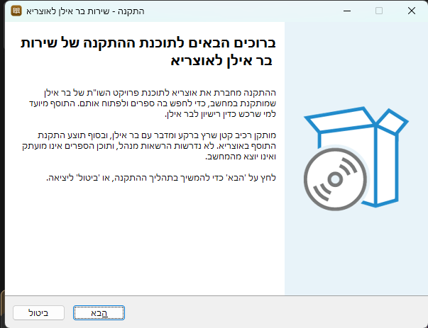

4. ההתקנה לוקחת כמה שניות. **לא נדרשות הרשאות מנהל.**
5. במסך הסיום השאירו את הסימון **"להתקין את התוסף באוצריא (מומלץ)"** ולחצו **"סיום"**.
   - **בעדכון** כתוב שם **"לעדכן את התוסף באוצריא לגרסה… (מומלץ)"**.
   - **אין סימון, וכתוב שהתוסף כבר מותקן ומעודכן?** אין צורך בשלב 3. לחצו "סיום".

   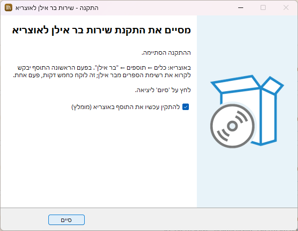

### שלב 3: אישור באוצריא

1. אוצריא נפתחת ומציגה את החלון **"התקנת תוסף: בר אילן"**.
2. בחלק **"הרשאות נדרשות"** יש כמה מתגים:
   - **הדליקו את "הוספת רכיבים לתוכנה".** אוצריא מציגה אותה כבויה, ובלעדיה אין "חיפוש בבר אילן" בלחיצה ימנית ואין קיצור מקלדת. היא לא מריצה שום דבר ברקע.
   - **את כל השאר השאירו כמו שהם.** מה שדלוק דלוק בכוונה:
     - **"גישה לשירותים מקומיים"**: בלעדיה התוסף לא יכול לדבר עם הרכיב שהתקנתם. היא **לא** פותחת גישה לאינטרנט.
     - **"פתיחת קישורים בדפדפן"**: כדי שהכפתורים "הורדת המתקין" ו"מדריך למשתמש" יעבדו.
     - **"פריטים בתפריט הטקסט"** ו**"קיצורי מקלדת"**: בשביל "חיפוש בבר אילן" בלחיצה ימנית ובקיצור `Ctrl+Alt+B`.
     - **"ניווט במסכים"**: כדי שקיצור מקלדת יוכל לפתוח את לשונית בר אילן.
     - **"יצירת קיצור דרך"**: בשביל הכפתור שיוצר קיצור בשולחן העבודה. אוצריא שואלת לפני שהיא יוצרת.
   - **"הפעלה ברקע לפי אירוע"** כבויה. כדאי להדליק גם אותה, אבל זו לא חובה. מה היא נותנת: ראו "עבודה ברקע" בהמשך.
   - **שכחתם?** אפשר להדליק כל הרשאה גם אחר כך: הגדרות אוצריא ← **כלים** ← "בר אילן". התוסף עצמו יזכיר לכם בהודעה מעל שורת החיפוש.
3. לחצו **"התקן"**.

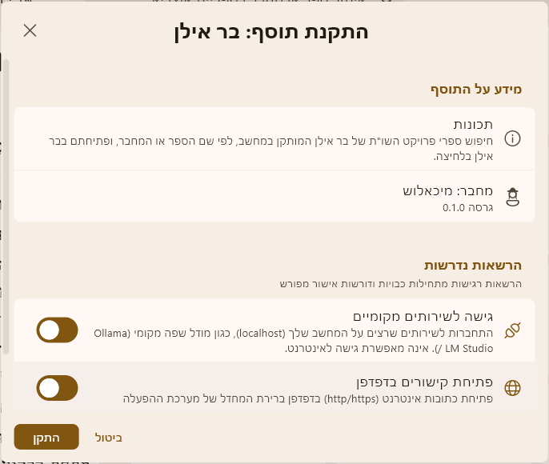

זהו. ההתקנה הסתיימה.

---

## הפעם הראשונה

### מסך הפתיחה

1. באוצריא, בסרגל שבצד ימין של החלון, לחצו על **"כלים"** (מתחת ל"חיפוש"). ובחלק **"תוספים"** לחצו על **"בר אילן"**: הסמל של **ספר פתוח עם זכוכית מגדלת**.

   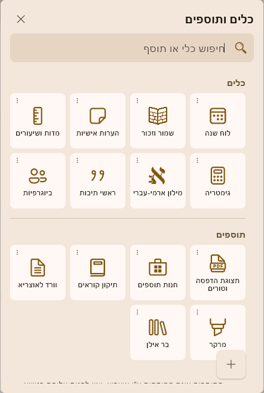

2. בפעם הראשונה נפתח המסך **"ברוכים הבאים לבר אילן באוצריא"**. יש בו, לפי הסדר:
   - **הבהרה חשובה** על רישיון בר אילן (ראו למעלה);
   - מה התוסף עושה;
   - **"מה צריך כדי להתחיל":** רשימה שמראה מה כבר **מוכן** ומה **חסר**:
     - תוכנת פרויקט השו"ת של בר אילן מותקנת במחשב;
     - "שירות בר אילן לאוצריא" מותקן ופועל;
     - ההרשאה "הוספת רכיבים לתוכנה" דלוקה;
     - רשימת הספרים נקראה מבר אילן.
3. לחצו **"הבנתי, בואו נתחיל"**. מה שחסר מוסבר בלשונית עצמה, צעד אחר צעד. **"איך משתמשים"** פותח את ההדרכה שבתוך התוסף.

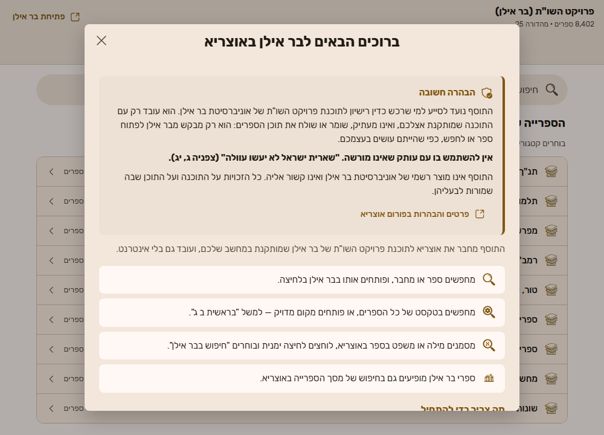

המסך לא יופיע שוב מעצמו. אפשר לחזור אליו מסימן השאלה ← **"אודות ודיווח"** ← **"מסך הפתיחה"**.

### קריאת רשימת הספרים (כחמש דקות, פעם אחת)

1. אחרי מסך הפתיחה יופיע המסך **"הכנה חד-פעמית"**. לחצו **"התחלה"**.

   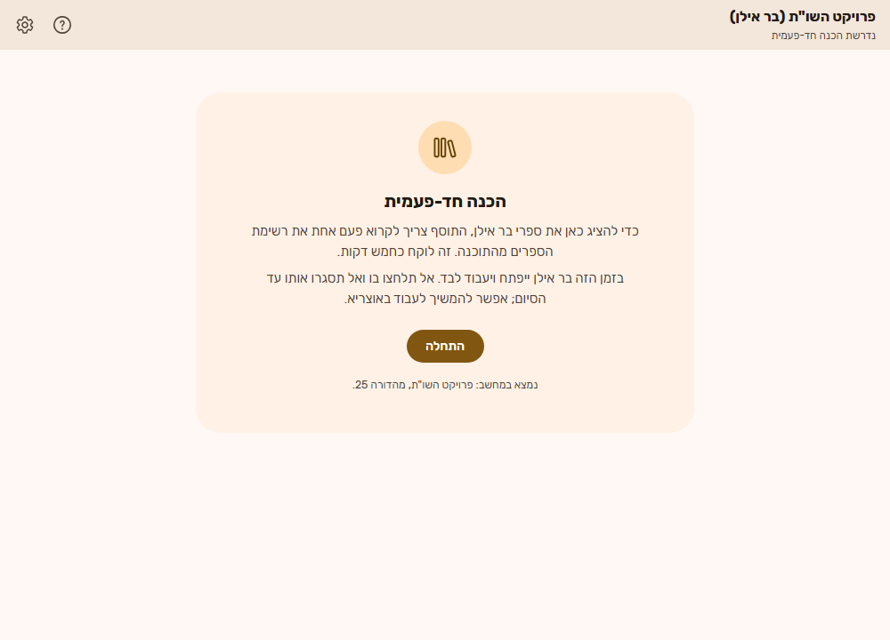

2. **בר אילן ייפתח לבד ויעבוד לבד.**
   - אל תלחצו בו ואל תסגרו אותו עד שהקריאה תסתיים.
   - אפשר להמשיך לעבוד באוצריא בינתיים, וגם לסגור את לשונית התוסף. הקריאה ממשיכה.
   - רוצים לעצור? לחצו **"ביטול"**. אפשר להתחיל שוב מתי שתרצו.

   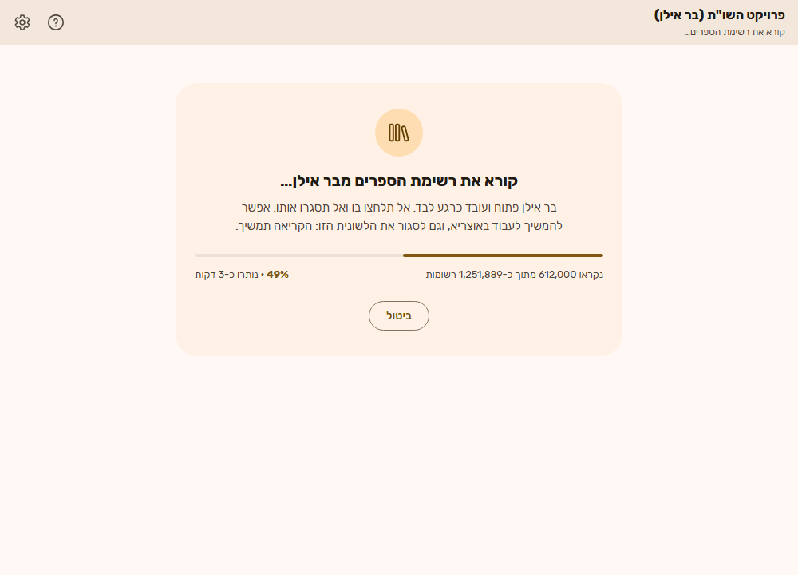

3. בסיום תופיע הודעה **"רשימת ספרי בר אילן מוכנה"**, ומסך החיפוש ייפתח.

---

## שימוש יומיומי

### חיפוש ספר

1. פתחו את התוסף: **כלים ← תוספים ← בר אילן**.
2. הקלידו בשורת החיפוש שם של ספר, שם של מחבר, או שניהם. התוצאות מופיעות תוך כדי הקלדה.

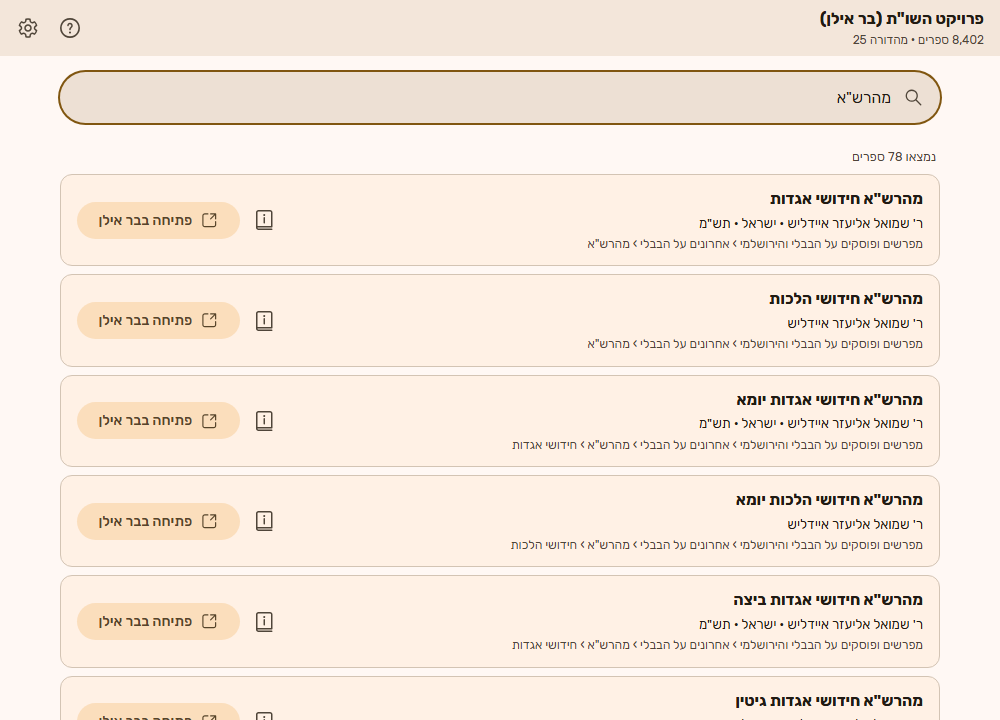

**טיפים לחיפוש:**
- **אפשר לכתוב בלי גרשיים:** `מהרשא` מוצא את `מהרש"א`.
- **כתיב מלא וחסר מוצאים אותו ספר:** `חדושי` מוצא גם `חידושי`.
- **אפשר לשלב מחבר ושם ספר:** `רא"ש יבמות`.
- **לא מצאתם?** נסו מילה אחת בלבד מהשם.
- **לנקות את החיפוש:** מקש `Esc`.

**בחלון צר** (למשל כשאוצריא פתוחה בחצי מסך) התוצאות מסתדרות לרוחב החלון, וכל הכפתורים נשארים זמינים.

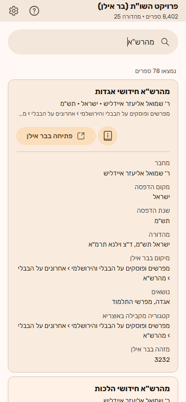

### פרטי הספר

ליד כל ספר יש כפתור קטן **"פרטי הספר"** (סמל של ספר עם האות i). לחיצה עליו פותחת מתחת לספר את כל מה שידוע עליו:

- מחבר, מקום הדפסה ושנת הדפסה;
- **מהדורה**: שורת המהדורה המלאה של בר אילן, כשיש בה יותר ממקום ושנה;
- **מיקום בבר אילן**: איפה הספר נמצא בעץ הספרים של בר אילן;
- נושאים, והקטגוריה המקבילה באוצריא, כשיש;
- **מזהה בבר אילן**: מספר הספר ברשימה. שימושי בפנייה לתמיכה.

לחיצה נוספת על הכפתור סוגרת את הפרטים. חיפוש חדש סוגר אותם לבד.

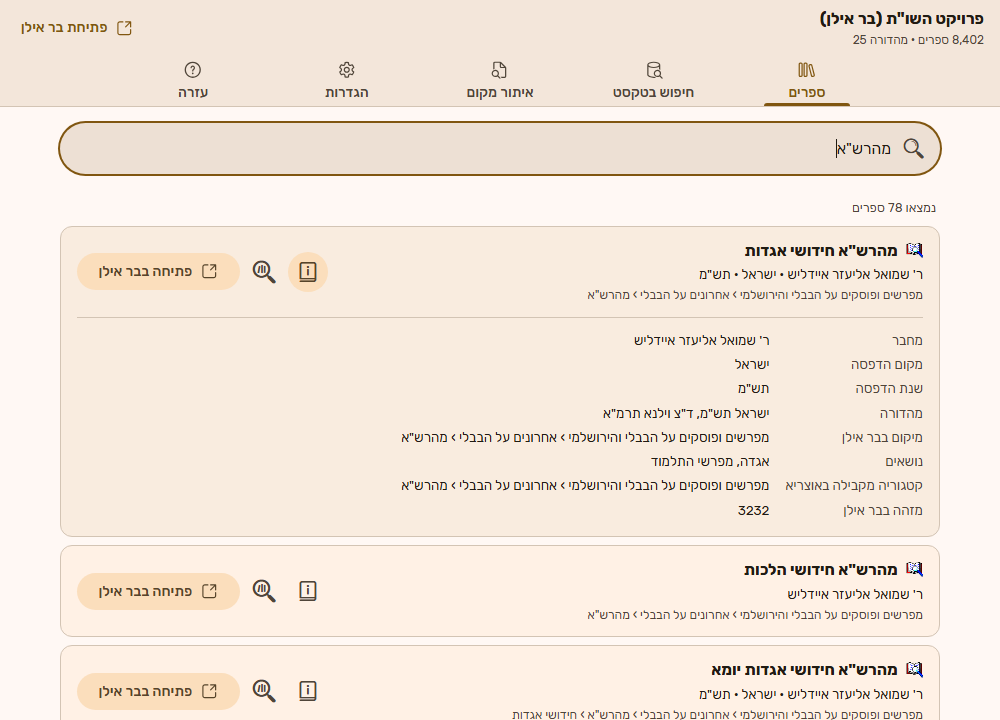

### פתיחת ספר

לחצו על **"פתיחה בבר אילן"** ליד הספר. בר אילן ייפתח (או יעלה לחזית אם הוא כבר פתוח), והספר יוצג בו.

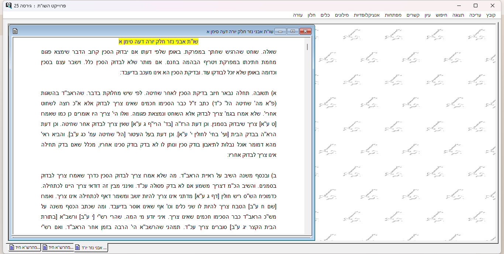

- **כמה זמן:** בדרך כלל שלוש שניות. אם בר אילן היה סגור, קצת יותר.
- **בזמן הפתיחה:** הכפתור מציג "פותח…". אי אפשר לפתוח ספר נוסף עד שהפתיחה מסתיימת.
- **אם הספר לא נפתח:** תופיע הודעה שמסבירה למה ומה אפשר לעשות. ראו גם "פתרון בעיות" בהמשך.

### חיפוש טקסט בבר אילן, מתוך ספר פתוח באוצריא

1. פתחו ספר כלשהו באוצריא, וסמנו בעכבר מילה או משפט.
2. לחצו **לחיצה ימנית** על הטקסט המסומן, ובחרו **"חיפוש בבר אילן"**.
   - **במקום לחיצה ימנית** אפשר ללחוץ יחד על **Ctrl+Alt+B**.
3. בר אילן עולה לחזית ומציג את **תוצאות החיפוש בחלון שלו**, כאילו הקלדתם את החיפוש בבר אילן עצמו.
4. באוצריא מופיעה הודעה קטנה, למשל **"בר אילן מצא 2,543 תוצאות"**.

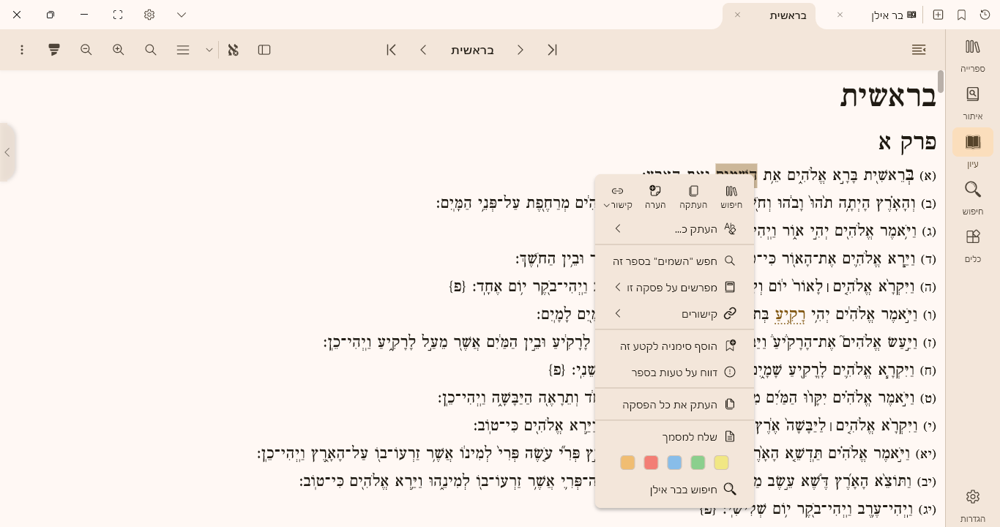

**כדאי לדעת:**
- **ניקוד, טעמים וסימני פיסוק מוסרים לבד** לפני החיפוש. גם ראשי תיבות עובדים: `רמב"ם`.
- **נשלחות עד עשר מילים.** אם סימנתם קטע ארוך, יחופשו עשר המילים הראשונות, ותופיע הודעה על כך.
- **בר אילן שואל "האם ברצונך לחפש בכל המאגרים?"**: זו שאלה של בר אילן עצמו, כי במאגרים שנבחרו בו לא נמצאו תוצאות. עונים עליה בחלון של בר אילן.
- **"נמצאו מעל 32000 תוצאות"**: החיפוש כללי מדי. סמנו קטע ארוך או מדויק יותר.
- **לא רוצים את הפריט בתפריט?** מכבים אותו בהגדרות התוסף (ראו "הגדרות").

### ספרי בר אילן במסך הספרייה של אוצריא (בגרסה עתידית)

**האפשרות הזו תופעל כשאוצריא תתמוך בה.** עד אז היא לא מופיעה בתוסף בכלל: לא בהגדרות, לא במסך הפתיחה ולא בעזרה. כך היא תעבוד:

1. במסך **הספרייה** של אוצריא, הקלידו בתיבה **"איתור ספר או מחבר"**, כרגיל.
2. בין התוצאות יופיעו גם ספרי בר אילן. **מתחת לשם הספר כתוב "בר אילן"** ואחריו מקומו בבר אילן.
3. לחיצה על ספר כזה **פותחת אותו בבר אילן**.

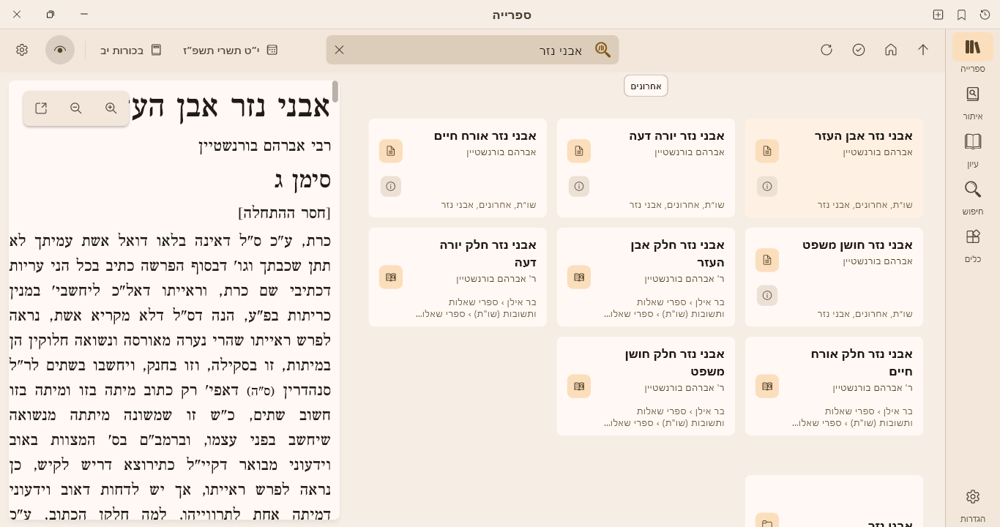

- הרשימה עוברת לאוצריא לבד, אחרי שהתוסף קרא אותה מבר אילן.
- צריך את ההרשאה "הוספת רכיבים לתוכנה".
- לא רוצים לראות את ספרי בר אילן שם? מכבים את המתג בהגדרות התוסף.

---

## הגדרות התוסף

**איפה:** גלגל השיניים **שבפינה השמאלית העליונה של לשונית בר אילן** (לא גלגל השיניים של אוצריא עצמה). הלוח נפתח מצד שמאל, כמו "הגדרות תצוגת הספרים" של אוצריא. סוגרים אותו ב-X, ב-`Esc` או בלחיצה מחוץ לו.

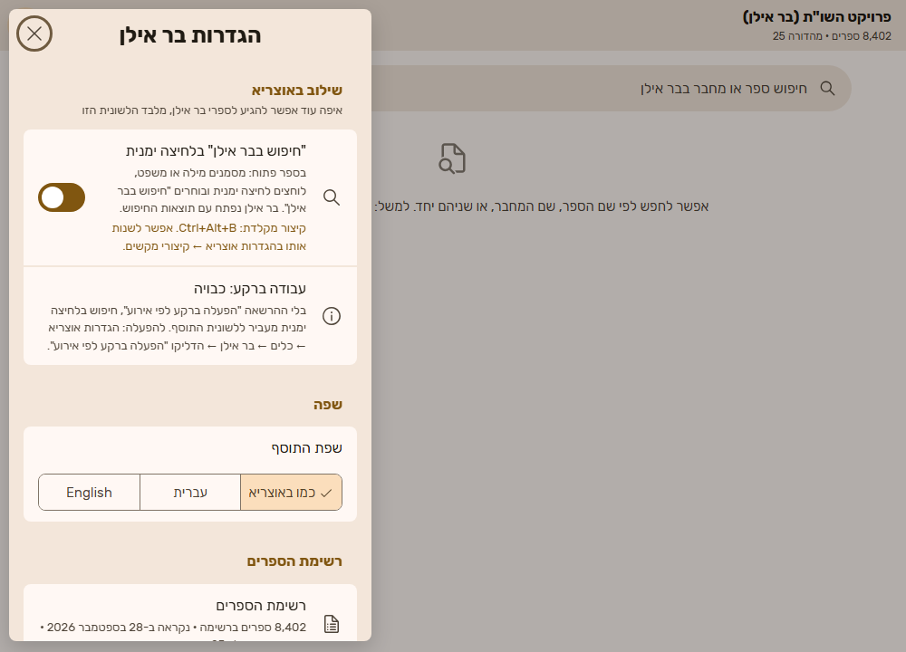

**שילוב באוצריא**
- **ספרי בר אילן בחיפוש הספרייה:** מציג (או מסתיר) את ספרי בר אילן בתיבה "איתור ספר או מחבר" של מסך הספרייה. המתג מופיע רק כשאוצריא תומכת בזה.
- **"חיפוש בבר אילן" בלחיצה ימנית:** מוסיף (או מסיר) את הפריט מהתפריט של לחיצה ימנית על טקסט מסומן. קיצור המקלדת `Ctrl+Alt+B` עובד רק כשהמתג דלוק. אפשר לשנות את הקיצור באוצריא: הגדרות ← קיצורי מקשים ← "קיצורי תוספים".
- **עבודה ברקע:** מראה אם ההרשאה "הפעלה ברקע לפי אירוע" דלוקה (ראו בהמשך).

**שפה:** "כמו באוצריא" (ברירת המחדל), עברית, או English. השינוי מיידי.

**רשימת הספרים:** כמה ספרים יש, מתי נקראו, ממהדורה כמה, וכפתור **"קריאה מחדש"**.

**קיצורי דרך:** כפתור שיוצר **קיצור בשולחן העבודה** (וגם **בתפריט התחל**) שפותח את אוצריא ישר בלשונית בר אילן.

**בתחתית הלוח:** "עזרה ותמיכה".

### עבודה ברקע (לא חובה)

בלי ההרשאה **"הפעלה ברקע לפי אירוע"**, כשבוחרים "חיפוש בבר אילן" בלחיצה ימנית, או לוחצים על ספר בר אילן במסך הספרייה, אוצריא עוברת ללשונית התוסף, והפעולה עובדת משם. עם ההרשאה, זה קורה בלי לעזוב את הספר או את מסך הספרייה.

**להדלקה:** באוצריא: הגדרות ← **כלים** ← "בר אילן" ← הדליקו **"הפעלה ברקע לפי אירוע"**. התוסף מתעורר רק כשבוחרים באחת הפעולות האלה, ונכבה לבד אחרי כמה דקות.

---

## עזרה ותמיכה בתוך התוסף

**איפה:** סימן השאלה שליד גלגל השיניים, בפינה העליונה של לשונית בר אילן. העזרה נפתחת על כל הלשונית; סוגרים ב-X שבפינה או ב-Esc.

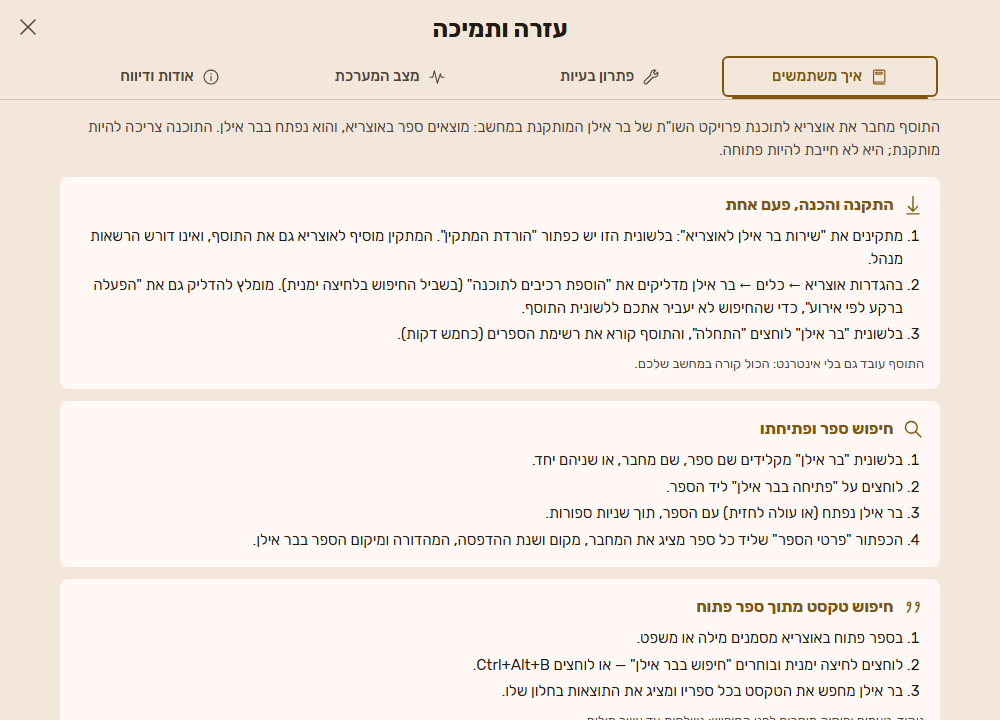

ארבע כרטיסיות:

### איך משתמשים

הדרכה קצרה, בתוך התוסף ובלי אינטרנט: התקנה והכנה, חיפוש ספר ופתיחתו, פרטי הספר, חיפוש טקסט מספר פתוח, קריאת רשימת הספרים והגדרות התוסף. בסוף יש קישור ל**מדריך המלא באתר** (המדריך הזה).

### פתרון בעיות

שאלות נפוצות. לוחצים על שאלה כדי לראות את התשובה.

### מצב המערכת

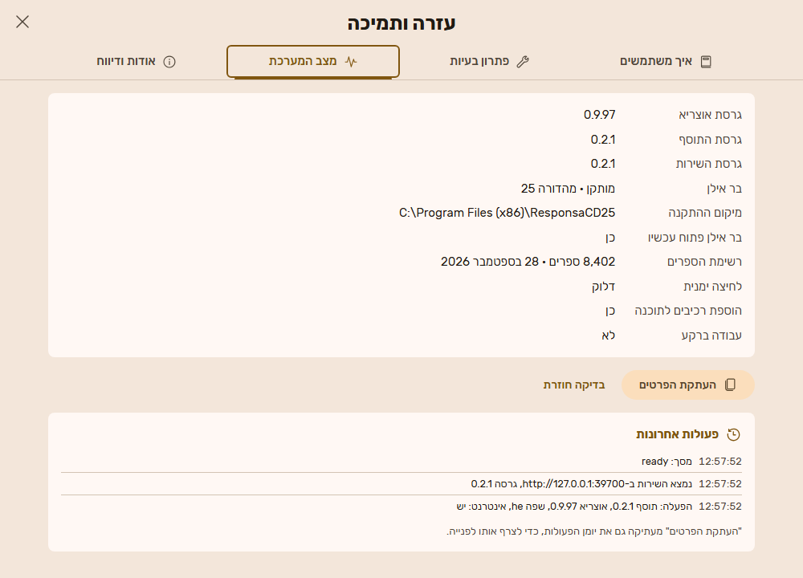

- **הפרטים:** גרסת אוצריא, גרסת התוסף והשירות, האם בר אילן מותקן ובאיזו מהדורה, איפה, האם הוא פתוח עכשיו, כמה ספרים ברשימה, ומה מצב ההרשאות.
- **"פעולות אחרונות":** מה התוסף עשה לאחרונה, מהחדש לישן. למשל: "נמצא השירות", "פתיחת קישור", או שגיאה. זה עוזר להבין מה קרה רגע לפני תקלה.
- **"העתקת הפרטים":** מעתיק את הפרטים ואת היומן המלא, להדבקה בפנייה לתמיכה. שם המשתמש שלכם ב-Windows מושמט מכל נתיב.
- **"בדיקה חוזרת":** בודק שוב את השירות ואת בר אילן.

### אודות ודיווח

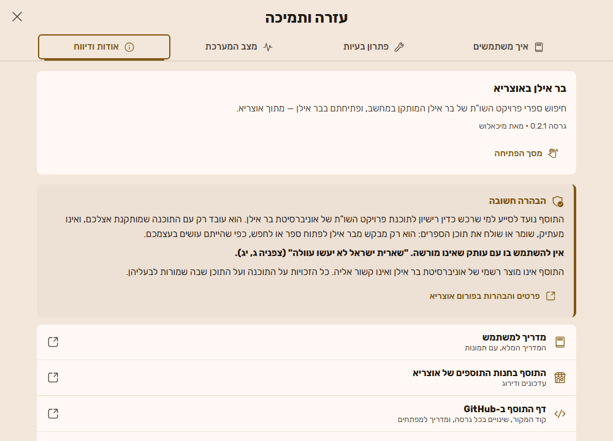

- **"מסך הפתיחה":** פותח שוב את מסך הפתיחה.
- **הבהרה חשובה:** אותה הבהרה על הרישיון שבמסך הפתיחה.
- **קישורים:** המדריך הזה, התוסף בחנות התוספים של אוצריא, דף התוסף ב-GitHub, דיווח או הצעה ב-GitHub, והורדת הגרסה האחרונה. **בלי אינטרנט** הקישורים לא נפתחים, ומוצגת הכתובת במקום.
- **"דיווח על בעיה":** כותבים מה ניסיתם לעשות ומה קרה (לפחות עשרה תווים), ולוחצים **"שליחת דיווח"**.
  - הדיווח עובר למפתח דרך אוצריא, יחד עם פרטי המערכת ויומן הפעולות האחרונות.
  - **בלי תוכן אישי ובלי נתיבים:** מיקום ההתקנה אינו נשלח, ושם המשתמש מושמט.
  - אוצריא מבקשת אישור לפני השליחה.
  - **בלי אינטרנט** הדיווח נשמר, ויישלח כשיהיה חיבור.

---

## בלי אינטרנט

**התוסף עובד בלי אינטרנט.** החיפוש, פרטי הספרים, הפתיחה בבר אילן והחיפוש בלחיצה ימנית קורים כולם במחשב שלכם.

מה כן צריך אינטרנט:
- **הורדת המתקין.** אם אין אינטרנט במחשב, מסך "צריך להתקין רכיב קטן" מסביר: מורידים את המתקין במחשב אחר, ומעבירים אותו בדיסק און קי.
- **הקישורים ב"אודות ודיווח".** בלי אינטרנט הם לא נפתחים, ומוצגת הכתובת. ההדרכה שבתוך התוסף ("איך משתמשים") זמינה תמיד.
- **שליחת דיווח.** הוא נשמר, ויישלח כשיהיה חיבור.

---

## מתי לקרוא את רשימת הספרים מחדש

**רק במקרים האלה:**
- התקנתם מהדורה חדשה של בר אילן;
- ספר מסוים לא נמצא או לא נפתח;
- מעל שורת החיפוש מופיע פס צבעוני עם משולש אזהרה, שממליץ לקרוא מחדש. אפשר ללחוץ ישר על "קריאה מחדש" שבתוכו.

**איך:** גלגל השיניים ← **"רשימת הספרים"** ← **"קריאה מחדש"**.
- זה לוקח כחמש דקות.
- **החיפוש ממשיך לעבוד בזמן הזה**, על הרשימה הקיימת.
- **פתיחת ספרים חוזרת בסיום**, כי בזמן הקריאה בר אילן תפוס.

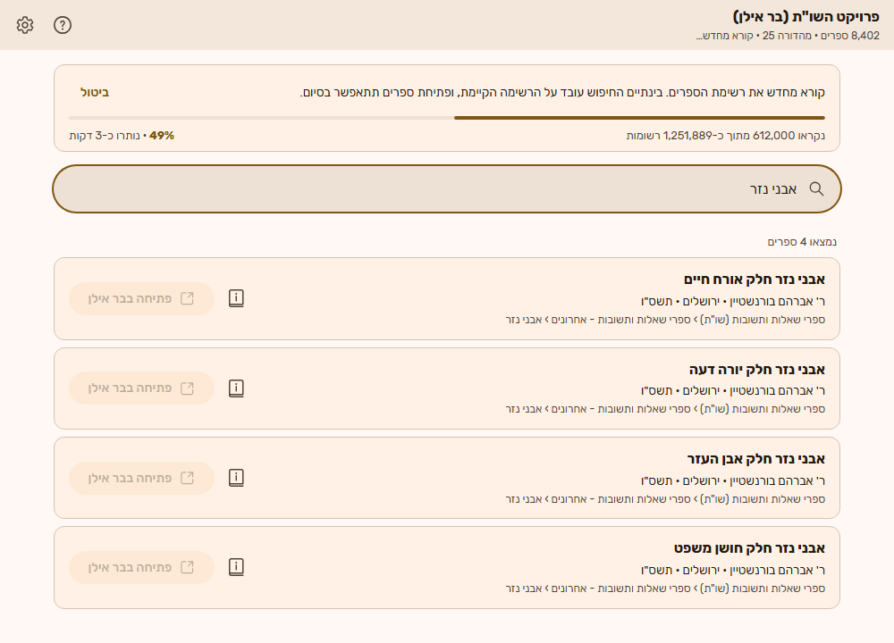

---

## פתרון בעיות

| מה רואים | מה זה אומר | מה עושים |
|---|---|---|
| **"צריך להתקין רכיב קטן, פעם אחת"** | השירות לא מותקן, או לא פועל כרגע | אם עוד לא התקנתם: "הורדת המתקין" והתקנה (ראו למעלה). אם כבר התקנתם: הפעילו מחדש את המחשב. המסך יתעדכן מעצמו. אין אינטרנט? הורידו את המתקין במחשב אחר |
| **"התוסף צריך הרשאה"** | ההרשאה "גישה לשירותים מקומיים" כבויה | באוצריא: הגדרות ← **כלים** ← "בר אילן" ← הדליקו "גישה לשירותים מקומיים". אחר כך "בדיקה חוזרת" |
| **"השירות לא מגיב כרגע"** | הרכיב פועל אבל לא עונה | "בדיקה חוזרת". אם זה חוזר, הפעילו מחדש את המחשב |
| **"צריך לעדכן את שירות בר אילן"** או **"צריך לעדכן את התוסף"** | גרסת השירות וגרסת התוסף לא מתאימות | "הורדת הגרסה החדשה" והתקנה. המתקין מעדכן את שניהם |
| **"בר אילן לא נמצא במחשב"** | תוכנת פרויקט השו"ת לא מותקנת | התקינו את בר אילן. המסך יתעדכן מעצמו |
| **"קריאת רשימת הספרים לא הושלמה"** | משהו הפריע בזמן הקריאה | קראו את ההסבר במסך ולחצו "ניסיון נוסף". שום דבר לא נמחק |
| **"אין גישה לבר אילן, כנראה כי הוא פועל כמנהל מערכת"** (בתוך המסך הקודם) | בר אילן נפתח עם "הפעל כמנהל" | סגרו את בר אילן, פתחו אותו רגיל (לחיצה כפולה על הסמל), ולחצו "ניסיון נוסף" |
| **"בר אילן הופעל אך לא עלה בתוך … שניות"** או **"בר אילן (…) אינו פעיל"** | בר אילן איטי לעלות | פתחו את בר אילן בעצמכם, חכו שייטען עד הסוף, ונסו שוב |
| **"תוכנה אחרת תופסת את החיבור של השירות"** | תוכנה אחרת במחשב משתמשת באותו חיבור (מספר פנימי במחשב, אין מה לשנות) | הפעילו מחדש את המחשב. אם זה חוזר, פנו לתמיכה |
| **"בבר אילן פתוחים כבר חלונות רבים"** | בר אילן מפסיק לפתוח חלונות אחרי כ-22 | סגרו בבר אילן כמה חלונות ישנים, ונסו שוב |
| **'בר אילן לא פתח את חלון "עיון"'** | חלון אחר פתוח בבר אילן ומחכה לתשובה | עברו לבר אילן, סגרו את החלון שפתוח בו (למשל הודעה), ונסו שוב |
| **"בר אילן לא הגיב בזמן"** או **"השירות לא הגיב בזמן"** | בר אילן עסוק או ממתין לתשובה | כנ"ל: עברו לבר אילן, סגרו חלון שמחכה, ונסו שוב |
| **"בטקסט שנבחר אין מילים בעברית"** | בחיפוש בבר אילן נבחרו רק מספרים, סימנים או אנגלית | סמנו מילה או משפט בעברית, ונסו שוב |
| **"בר אילן לא פתח את חלון החיפוש"** או **"בר אילן לא השיב על החיפוש בזמן"** | חלון אחר פתוח בבר אילן ומחכה לתשובה, או שבר אילן עסוק | עברו לבר אילן, סגרו את החלון שפתוח בו, ונסו שוב |
| **"בר אילן מחפש כרגע"** או **"ספר נפתח כרגע בבר אילן"** | פעולה קודמת עוד לא הסתיימה | חכו כמה שניות ונסו שוב |
| **בלחיצה ימנית על "חיפוש בבר אילן" נפתחת לשונית התוסף** | ההרשאה "הפעלה ברקע לפי אירוע" כבויה | זה תקין, והחיפוש עובד. כדי להישאר בספר: ראו "עבודה ברקע" |
| **אין "חיפוש בבר אילן" בתפריט של לחיצה ימנית** | המתג בהגדרות התוסף כבוי, או שלא סומן טקסט | סמנו טקסט לפני הלחיצה הימנית, ובדקו את המתג בהגדרות התוסף |
| **ספרי בר אילן לא מופיעים במסך הספרייה** | גרסת אוצריא שלכם עוד לא תומכת בזה (ואז אין מתג כזה בהגדרות התוסף), המתג כבוי, ההרשאה "הוספת רכיבים לתוכנה" כבויה, או שהרשימה עוד לא נקראה | כשיש מתג: הדליקו אותו ואת ההרשאה, והקלידו לפחות שלוש אותיות |
| **'בר אילן לא זיהה את "…"'** | הספר לא קיים במהדורה המותקנת, או שהרשימה ישנה | גלגל השיניים ← "קריאה מחדש", ונסו שוב |
| **'בר אילן פתח ספר אחר במקום "…", והפתיחה בוטלה'** | התוסף זיהה שנפתח ספר לא נכון וסגר אותו | זה מכוון, כדי לא להציג ספר שגוי. נסו ספר אחר מאותה סדרה, או בנייה מחדש |
| **"רשימת התוצאות בבר אילן לא התנקתה"** | תקלה רגעית בבר אילן | נסו שוב. זה נדיר |
| **פס צבעוני: "הרשימה נקראה מהתקנה אחרת"** או **"נקראה בגרסה קודמת של התוסף"** | הרשימה ישנה | לחצו "קריאה מחדש" שבתוך הפס |
| **פס צבעוני: "קריאת הרשימה מחדש לא הושלמה"** | ניסיון קודם לקרוא מחדש נכשל | הרשימה הקודמת עדיין עובדת. אפשר לנסות שוב ב"קריאה מחדש" |
| **"לא ניתן לפתוח את הדפדפן. הכתובת: …"** | ההרשאה "פתיחת קישורים בדפדפן" כבויה | הדליקו אותה בהגדרות ← כלים, או העתיקו את הכתובת לדפדפן |
| **"אין כרגע חיבור לאינטרנט, ולכן הדף לא ייפתח"** | אין אינטרנט במחשב | זה לא משפיע על התוסף. ההדרכה זמינה ב"איך משתמשים", ואת הכתובת אפשר לפתוח במחשב אחר |
| **במסך השגיאה כתוב "קוד לתמיכה: …"** | שם קצר של התקלה, בשביל מי שעוזר לכם | ציטטו אותו בפנייה לתמיכה, יחד עם "העתקת הפרטים" |
| **במתקין: "לא נמצאה אוצריא במחשב"** | אוצריא לא מותקנת | התקינו את אוצריא, ואז לחצו לחיצה כפולה על הקובץ שמוצג בהודעה |
| **הספר נפתח, אבל החלון לא הופיע** | בר אילן נפתח מאחורי חלונות אחרים | לחצו על סמל בר אילן בשורת המשימות (הפס התחתון של המסך) |

### עדיין לא עובד?

1. **הפעילו מחדש את המחשב.** זה פותר את רוב הבעיות.
2. **שלחו דיווח מתוך התוסף:** סימן השאלה ← "אודות ודיווח" ← "דיווח על בעיה".
3. **או פנו לתמיכה** ב[פורום אוצריא](https://otzaria.org/forum), או ב-[Issues של הפרויקט](https://github.com/mmichaelush/otzaria-responsa-plugin/issues). צרפו:
   - מה ניסיתם לעשות ומה ראיתם, ואת **"קוד לתמיכה"** אם הופיע;
   - את **פרטי המערכת ויומן הפעולות**: סימן השאלה ← "מצב המערכת" ← "העתקת הפרטים", והדבקה בפנייה;
   - **את קובץ היומן.** כדי למצוא אותו:
     1. לחצו יחד על מקש **Windows** ועל **R**.
     2. בחלון שנפתח הדביקו `%LOCALAPPDATA%\OtzariaResponsa` ולחצו **אישור**.
     3. צרפו את הקובץ **helper**. ייתכן שהסיומת `.log` לא תוצג.

---

## עדכון והסרה

**עדכון:** מורידים את המתקין החדש ומתקינים. **רשימת הספרים נשמרת**, ואין צורך לקרוא אותה מחדש.

**הסרה:**
- **Windows 11:** הגדרות ← אפליקציות ← אפליקציות מותקנות ← ליד "שירות בר אילן לאוצריא" לחצו על שלוש הנקודות ← הסרת התקנה.
- **Windows 10:** הגדרות ← אפליקציות ← לחצו על "שירות בר אילן לאוצריא" ← הסר.
- **התוסף עצמו:** מסירים אותו באוצריא, בהגדרות ← **כלים**.
- **רשימת הספרים:** נשארת בתיקייה `%LOCALAPPDATA%\OtzariaResponsa`, למקרה שתתקינו שוב. אפשר למחוק את התיקייה ידנית.

---

## שאלות נפוצות

**האם צריך אינטרנט?**
לא. הכול קורה במחשב שלכם. אינטרנט נדרש רק להורדת המתקין, לקישורים ולשליחת דיווח (ראו "בלי אינטרנט").

**מה הסמל של התוסף?**
ספר פתוח עם זכוכית מגדלת. כך הוא מופיע בסרגל הכלים של אוצריא, בחנות התוספים ובמתקין.

**האם התוסף רץ ברקע כל הזמן מאז שאוצריא נפתחת?**
לא. אוצריא מעירה את התוסף רק כשצריך אותו: בלחיצה ימנית על "חיפוש בבר אילן", בקיצור המקלדת, או בבחירת ספר של בר אילן בספרייה. אחרי שלוש דקות בלי פעילות היא מכבה אותו. רשימת הספרים לספרייה שמורה אצל אוצריא, ולכן היא מופיעה גם בלי שהתוסף פועל. מה שפועל תמיד הוא "שירות בר אילן לאוצריא" (ראו בהמשך): תהליך קטן, כ-16MB, שממתין לבקשות.

**האם התוסף משנה משהו בבר אילן?**
לא. הוא רק קורא את רשימת הספרים ופותח ספרים, בדיוק כמו שמשתמש היה עושה.

**למה בר אילן נפתח לבד בזמן ההכנה?**
רשימת הספרים נמצאת רק בתוך התוכנה, ולכן התוסף צריך אותה פתוחה כדי לקרוא אותה. אחרי ההכנה, בר אילן נפתח רק כשמבקשים לפתוח ספר.

**יש לי שתי מהדורות של בר אילן. מה קורה?**
התוסף עובד עם המהדורה שממנה נקראה הרשימה. אם תעברו למהדורה אחרת, תופיע המלצה לקרוא את הרשימה מחדש.

**במחשב יש כמה משתמשי Windows. זה עובד?**
כן. לכל משתמש יש שירות משלו, וכל אחד רואה ופותח ספרים רק על המסך שלו.

**מה זה "שירות בר אילן לאוצריא" שמופיע ברשימת האפליקציות?**
זה הרכיב שהמתקין מתקין.
- הוא רץ ברקע ומדבר עם בר אילן בשביל אוצריא.
- הוא קטן, ולא צורך משאבים כשלא משתמשים בו.
- הוא נפתח לבד בכל כניסה ל-Windows. אם כיביתם אותו, הדליקו אותו שוב: מנהל המשימות (Ctrl+Shift+Esc) ← **אפליקציות הפעלה** ← `responsa_helper` ← **הפעל**.
