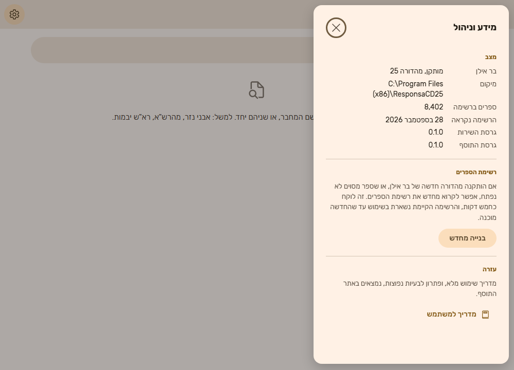

# מדריך למשתמש: ספרי בר אילן באוצריא

המדריך מסביר איך להתקין את התוסף, איך משתמשים בו, ומה עושים כשמשהו לא עובד. אין צורך בידע טכני.

> **שתי מילים שתראו בתוסף:**
> - **"שירות"** הוא רכיב קטן שהמתקין מתקין במחשב, בשם "שירות בר אילן לאוצריא". הוא מה שמדבר עם תוכנת בר אילן.
> - **"רשימת הספרים"** היא הרשימה שהתוסף קורא פעם אחת מבר אילן, כדי שתוכלו לחפש בה.

---

## מה התוסף עושה

אם במחשב שלכם מותקנת התוכנה **פרויקט השו"ת של בר אילן**, התוסף מאפשר:

- **לחפש** את ספרי בר אילן מתוך אוצריא, לפי שם הספר או שם המחבר;
- **לראות** לכל ספר את המחבר, מקום ההדפסה ושנת ההדפסה;
- **לפתוח** את הספר בבר אילן בלחיצה אחת.

**מה התוסף לא עושה:**
- הוא לא מעתיק את תוכן הספרים לאוצריא. הספר נפתח בתוכנת בר אילן עצמה.
- הוא לא שולח שום מידע מהמחשב החוצה, ולא צריך אינטרנט כדי לעבוד.

---

## מה צריך

- מחשב עם **Windows 10 ומעלה** (64 ביט);
- **אוצריא** מותקנת (גרסה 0.9.97 ומעלה);
- **פרויקט השו"ת של בר אילן** מותקן, בכל מהדורה.

---

## התקנה (פעם אחת, כשתי דקות)

### שלב 1: הורדת המתקין

1. היכנסו לדף ההורדות: <https://github.com/mmichaelush/otzaria-responsa-plugin/releases/latest>
2. בחלק **Assets** לחצו על הקובץ ששמו מתחיל ב-**`OtzariaResponsa-Setup`** ומסתיים ב-**`.exe`**.
   - לא על הקובץ שמסתיים ב-`.otzplugin`;
   - ולא על "Source code".
3. **אם הדפדפן כותב שהקובץ "אינו מוריד בדרך כלל":** לחצו על שלוש הנקודות שליד ההודעה ← **"שמור"** ← **"שמור בכל זאת"**.
4. **אם ההורדה לא מתחילה בכלל:** ייתכן שהסינון חוסם את האתר. אפשר לבקש את הקובץ ב[פורום אוצריא](https://otzaria.org/forum).

> **התוסף כבר מותקן באוצריא** ומציג "צריך להתקין רכיב קטן"? אפשר ללחוץ שם על **"הורדת המתקין"**. זה אותו קובץ.

### שלב 2: הפעלת המתקין

1. פתחו את הקובץ שירד. בדרך כלל הוא בתיקיית "הורדות".
2. ייתכן שתופיע הודעה כחולה: **"Windows הגן על המחשב שלך"**.
   - זה קורה כי המתקין חדש ועדיין לא מוכר ל-Windows.
   - לחצו על **"מידע נוסף"**, ואז על **"הפעל בכל זאת"**.
3. במסך הפתיחה לחצו **"הבא"**.

   

4. ההתקנה לוקחת כמה שניות. **לא נדרשות הרשאות מנהל.**
5. במסך הסיום השאירו את הסימון **"להתקין עכשיו את התוסף באוצריא (מומלץ)"** ולחצו **"סיום"**.

   

### שלב 3: אישור באוצריא

1. אוצריא נפתחת ומציגה את החלון **"התקנת תוסף: בר אילן"**.
2. בחלק **"הרשאות נדרשות"** יש שני מתגים, **ושניהם כבר דלוקים**. השאירו אותם כך:
   - **"גישה לשירותים מקומיים"**: בלעדיה התוסף לא יכול לדבר עם הרכיב שהתקנתם. היא **לא** פותחת גישה לאינטרנט.
   - **"פתיחת קישורים בדפדפן"**: כדי שהכפתורים "הורדת המתקין" ו"מדריך למשתמש" יעבדו.
3. לחצו **"התקן"**.

זהו. ההתקנה הסתיימה.

---

## הפעם הראשונה: קריאת רשימת הספרים (כחמש דקות, פעם אחת)

1. באוצריא, בסרגל שבצד ימין של החלון, לחצו על **"כלים"** (הכפתור האחרון בסרגל). ובחלק **"תוספים"** לחצו על **"בר אילן"**.

   

2. יופיע המסך **"הכנה חד-פעמית"**. לחצו **"התחלה"**.

   

3. **בר אילן ייפתח לבד ויעבוד לבד.**
   - אל תלחצו בו ואל תסגרו אותו עד שהקריאה תסתיים.
   - אפשר להמשיך לעבוד באוצריא בינתיים, וגם לסגור את לשונית התוסף. הקריאה ממשיכה.
   - רוצים לעצור? לחצו **"ביטול"**. אפשר להתחיל שוב מתי שתרצו.

   

4. בסיום תופיע הודעה **"רשימת ספרי בר אילן מוכנה"**, ומסך החיפוש ייפתח.

---

## שימוש יומיומי

### חיפוש ספר

1. פתחו את התוסף: **כלים ← תוספים ← בר אילן**.
2. הקלידו בשורת החיפוש שם של ספר, שם של מחבר, או שניהם. התוצאות מופיעות תוך כדי הקלדה.

**טיפים לחיפוש:**
- **אפשר לכתוב בלי גרשיים:** `מהרשא` מוצא את `מהרש"א`.
- **כתיב מלא וחסר מוצאים אותו ספר:** `חדושי` מוצא גם `חידושי`.
- **אפשר לשלב מחבר ושם ספר:** `רא"ש יבמות`.
- **לא מצאתם?** נסו מילה אחת בלבד מהשם.
- **לנקות את החיפוש:** מקש `Esc`.

### פתיחת ספר

לחצו על **"פתיחה בבר אילן"** ליד הספר. בר אילן ייפתח (או יעלה לחזית אם הוא כבר פתוח), והספר יוצג בו.

- **כמה זמן:** בדרך כלל שלוש שניות. אם בר אילן היה סגור, קצת יותר.
- **בזמן הפתיחה:** הכפתור מציג "פותח…". אי אפשר לפתוח ספר נוסף עד שהפתיחה מסתיימת.
- **אם הספר לא נפתח:** תופיע הודעה שמסבירה למה ומה אפשר לעשות. ראו גם "פתרון בעיות" בהמשך.

### מידע וניהול

**איפה:** גלגל השיניים **שבפינה השמאלית העליונה של מסך התוסף**, מתחת לשורת הלשוניות. לא גלגל השיניים של אוצריא עצמה.

**מה יש שם:**
- מצב בר אילן והמהדורה שלו;
- כמה ספרים יש ברשימה, ומתי היא נקראה;
- כפתור **"בנייה מחדש"** של הרשימה;
- כפתור **"מדריך למשתמש"**, שפותח את המדריך הזה.

---

## מתי לקרוא את רשימת הספרים מחדש

**רק במקרים האלה:**
- התקנתם מהדורה חדשה של בר אילן;
- ספר מסוים לא נמצא או לא נפתח;
- מעל שורת החיפוש מופיע פס צבעוני עם משולש אזהרה, שממליץ לקרוא מחדש. אפשר ללחוץ ישר על "בנייה מחדש" שבתוכו.

**איך:** גלגל השיניים ← **"בנייה מחדש"**.
- זה לוקח כחמש דקות.
- **החיפוש ממשיך לעבוד בזמן הזה**, על הרשימה הקיימת.
- **פתיחת ספרים חוזרת בסיום**, כי בזמן הקריאה בר אילן תפוס.

---

## פתרון בעיות

| מה רואים | מה זה אומר | מה עושים |
|---|---|---|
| **"צריך להתקין רכיב קטן, פעם אחת"** | השירות לא מותקן, או לא פועל כרגע | אם עוד לא התקנתם: "הורדת המתקין" והתקנה (ראו למעלה). אם כבר התקנתם: הפעילו מחדש את המחשב. המסך יתעדכן מעצמו |
| **"התוסף צריך הרשאה"** | ההרשאה "גישה לשירותים מקומיים" כבויה | באוצריא: הגדרות ← **ניהול תוספים** ← "בר אילן" ← הדליקו "גישה לשירותים מקומיים". אחר כך "בדיקה חוזרת" |
| **"השירות לא מגיב כרגע"** | הרכיב פועל אבל לא עונה | "בדיקה חוזרת". אם זה חוזר, הפעילו מחדש את המחשב |
| **"צריך לעדכן את שירות בר אילן"** או **"צריך לעדכן את התוסף"** | גרסת השירות וגרסת התוסף לא מתאימות | "הורדת הגרסה החדשה" והתקנה. המתקין מעדכן את שניהם |
| **"בר אילן לא נמצא במחשב"** | תוכנת פרויקט השו"ת לא מותקנת | התקינו את בר אילן. המסך יתעדכן מעצמו |
| **"קריאת רשימת הספרים לא הושלמה"** | משהו הפריע בזמן הקריאה | קראו את ההסבר במסך ולחצו "ניסיון נוסף". שום דבר לא נמחק |
| **"אין גישה לבר אילן, כנראה כי הוא פועל כמנהל מערכת"** (בתוך המסך הקודם) | בר אילן נפתח עם "הפעל כמנהל" | סגרו את בר אילן, פתחו אותו רגיל (לחיצה כפולה על הסמל), ולחצו "ניסיון נוסף" |
| **"בר אילן הופעל אך לא עלה בתוך … שניות"** או **"בר אילן (…) אינו פעיל"** | בר אילן איטי לעלות | פתחו את בר אילן בעצמכם, חכו שייטען עד הסוף, ונסו שוב |
| **"תוכנה אחרת תופסת את החיבור של השירות"** | תוכנה אחרת במחשב משתמשת באותו חיבור (מספר פנימי במחשב, אין מה לשנות) | הפעילו מחדש את המחשב. אם זה חוזר, פנו לתמיכה |
| **"בבר אילן פתוחים כבר חלונות רבים"** | בר אילן מפסיק לפתוח חלונות אחרי כ-22 | סגרו בבר אילן כמה חלונות ישנים, ונסו שוב |
| **'בר אילן לא פתח את חלון "עיון"'** | חלון אחר פתוח בבר אילן ומחכה לתשובה | עברו לבר אילן, סגרו את החלון שפתוח בו (למשל הודעה), ונסו שוב |
| **"בר אילן לא הגיב בזמן"** או **"השירות לא הגיב בזמן"** | בר אילן עסוק או ממתין לתשובה | כנ"ל: עברו לבר אילן, סגרו חלון שמחכה, ונסו שוב |
| **'בר אילן לא זיהה את "…"'** | הספר לא קיים במהדורה המותקנת, או שהרשימה ישנה | גלגל השיניים ← "בנייה מחדש", ונסו שוב |
| **'בר אילן פתח ספר אחר במקום "…", והפתיחה בוטלה'** | התוסף זיהה שנפתח ספר לא נכון וסגר אותו | זה מכוון, כדי לא להציג ספר שגוי. נסו ספר אחר מאותה סדרה, או בנייה מחדש |
| **"רשימת התוצאות בבר אילן לא התנקתה"** | תקלה רגעית בבר אילן | נסו שוב. זה נדיר |
| **פס צבעוני: "הרשימה נקראה מהתקנה אחרת"** או **"נקראה בגרסה קודמת של התוסף"** | הרשימה ישנה | לחצו "בנייה מחדש" שבתוך הפס |
| **פס צבעוני: "קריאת הרשימה מחדש לא הושלמה"** | ניסיון קודם לקרוא מחדש נכשל | הרשימה הקודמת עדיין עובדת. אפשר לנסות שוב ב"בנייה מחדש" |
| **"לא ניתן לפתוח את הדפדפן. הכתובת: …"** | ההרשאה "פתיחת קישורים בדפדפן" כבויה | הדליקו אותה בהגדרות ← ניהול תוספים, או העתיקו את הכתובת לדפדפן |
| **במתקין: "לא נמצאה אוצריא במחשב"** | אוצריא לא מותקנת | התקינו את אוצריא, ואז לחצו לחיצה כפולה על הקובץ שמוצג בהודעה |
| **הספר נפתח, אבל החלון לא הופיע** | בר אילן נפתח מאחורי חלונות אחרים | לחצו על סמל בר אילן בשורת המשימות (הפס התחתון של המסך) |

### עדיין לא עובד?

1. **הפעילו מחדש את המחשב.** זה פותר את רוב הבעיות.
2. **פנו לתמיכה** ב[פורום אוצריא](https://otzaria.org/forum), או ב-[Issues של הפרויקט](https://github.com/mmichaelush/otzaria-responsa-plugin/issues). צרפו:
   - מה ניסיתם לעשות ומה ראיתם;
   - מהדורת בר אילן (מופיעה בגלגל השיניים של התוסף);
   - **את קובץ היומן.** כדי למצוא אותו:
     1. לחצו יחד על מקש **Windows** ועל **R**.
     2. בחלון שנפתח הדביקו `%LOCALAPPDATA%\OtzariaResponsa` ולחצו **אישור**.
     3. צרפו את הקובץ **helper**. ייתכן שהסיומת `.log` לא תוצג.

---

## עדכון והסרה

**עדכון:** מורידים את המתקין החדש ומתקינים. **רשימת הספרים נשמרת**, ואין צורך לקרוא אותה מחדש.

**הסרה:**
- **Windows 11:** הגדרות ← אפליקציות ← אפליקציות מותקנות ← ליד "שירות בר אילן לאוצריא" לחצו על שלוש הנקודות ← הסרת התקנה.
- **Windows 10:** הגדרות ← אפליקציות ← לחצו על "שירות בר אילן לאוצריא" ← הסר.
- **התוסף עצמו:** מסירים אותו באוצריא, בהגדרות ← **ניהול תוספים**.
- **רשימת הספרים:** נשארת בתיקייה `%LOCALAPPDATA%\OtzariaResponsa`, למקרה שתתקינו שוב. אפשר למחוק את התיקייה ידנית.

---

## שאלות נפוצות

**האם צריך אינטרנט?**
לא. הכול קורה במחשב שלכם.

**האם התוסף משנה משהו בבר אילן?**
לא. הוא רק קורא את רשימת הספרים ופותח ספרים, בדיוק כמו שמשתמש היה עושה.

**למה בר אילן נפתח לבד בזמן ההכנה?**
רשימת הספרים נמצאת רק בתוך התוכנה, ולכן התוסף צריך אותה פתוחה כדי לקרוא אותה. אחרי ההכנה, בר אילן נפתח רק כשמבקשים לפתוח ספר.

**יש לי שתי מהדורות של בר אילן. מה קורה?**
התוסף עובד עם המהדורה שממנה נקראה הרשימה. אם תעברו למהדורה אחרת, תופיע המלצה לקרוא את הרשימה מחדש.

**במחשב יש כמה משתמשי Windows. זה עובד?**
כן. לכל משתמש יש שירות משלו, וכל אחד רואה ופותח ספרים רק על המסך שלו.

**מה זה "שירות בר אילן לאוצריא" שמופיע ברשימת האפליקציות?**
זה הרכיב שהמתקין מתקין.
- הוא רץ ברקע ומדבר עם בר אילן בשביל אוצריא.
- הוא קטן, ולא צורך משאבים כשלא משתמשים בו.
- הוא נפתח לבד בכל כניסה ל-Windows. אם כיביתם אותו, הדליקו אותו שוב: מנהל המשימות (Ctrl+Shift+Esc) ← **אפליקציות הפעלה** ← `responsa_helper` ← **הפעל**.
